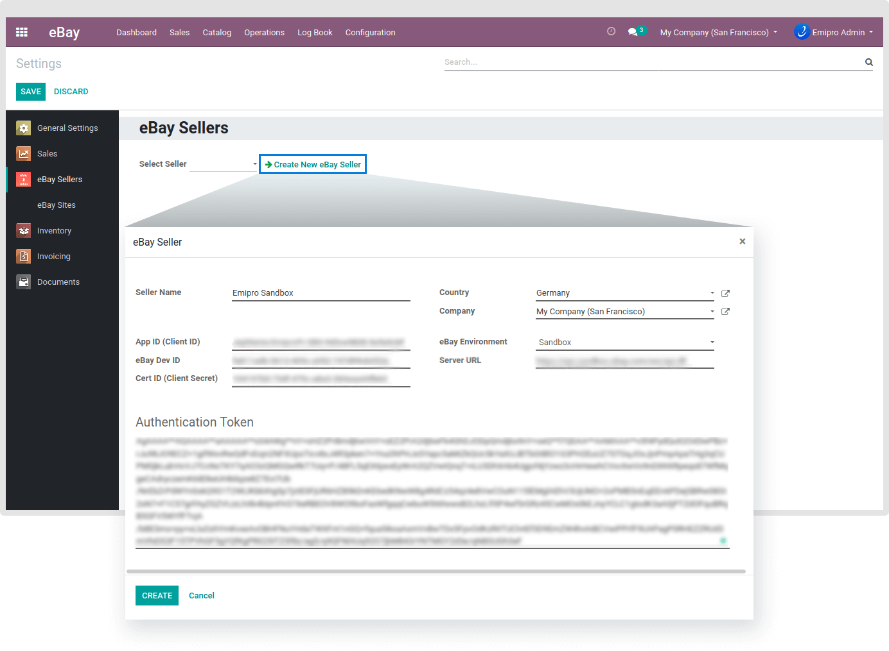

### Create a new seller

After the installation of this module, the next step is to configure eBay Seller & the necessary settings for the connector under **eBay / Configuration / eBay Settings****.** All the other configured eBay sellers will be visible in the drop-down menu. 

Click on **Create New eBay Seller** button and enter the required information asked in a new window such as Seller Name, Country, Company, App ID (Client ID), eBay Dev ID, Cert ID (Client Secret), eBay Environment, and Server URL. After entering these, paste the Authentication Token that you acquired from the eBay Seller Portal. 

  

To get the step-by-step guide on how to create Application Keyset and User Token, visit <https://www.emiprotechnologies.com/technical_notes/odoo-technical-notes-59/post/how-to-obtain-application-keyset-user-token-for-connecting-ebay-with-odoo-647>

 

