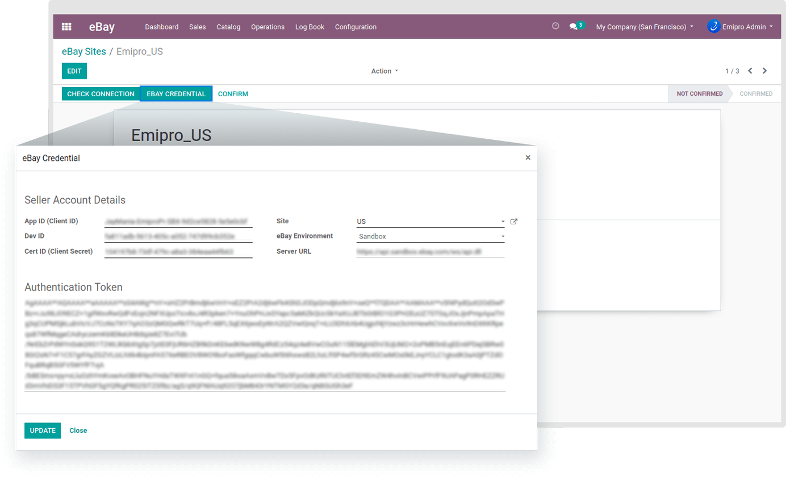

### Create a new eBay site

Upon successfully configuring the eBay instance, all the eBay Sites configured in the Seller’s account will be automatically imported into Odoo. A seller needs to setup & configure each eBay site that is imported. Let’s discuss this process in more detail.

Navigate to the **eBay / eBay Sellers** and you will see the list of all the Sellers imported in Odoo. Click on **Add More Sites** to integrate.  

You will see that a particular eBay site is yet to be confirmed. To verify the site’s connectivity, click on **Check Connection** before you confirm the site. After clicking on eBay Credentials, you can verify/ modify your credentials which were entered at the time of eBay seller creation. After verifying/ modifying credentials, it’s time to confirm the eBay site. Your eBay site should be activated after you click the **Confirm** button.

 

