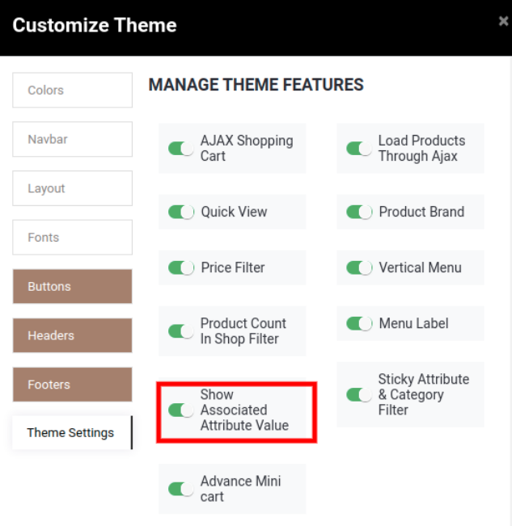
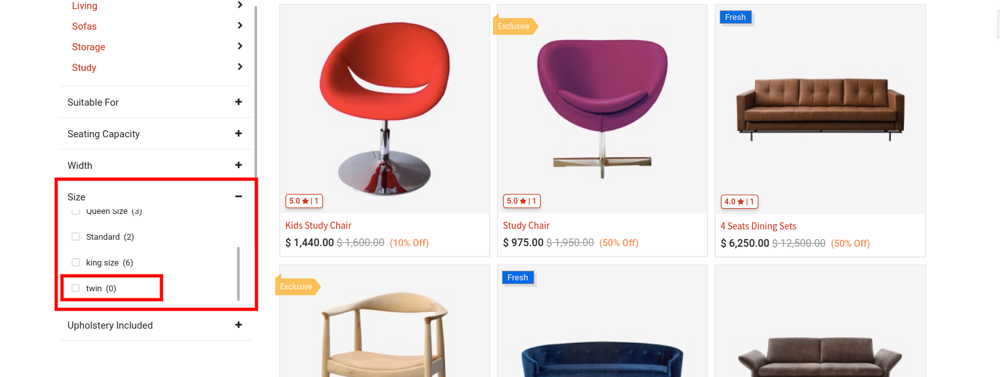
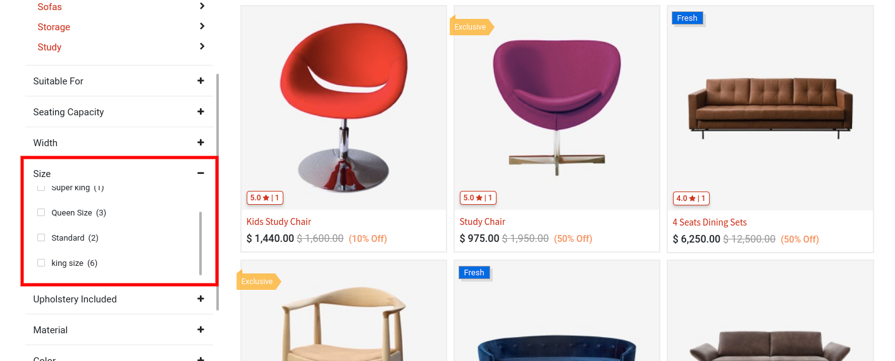

### Show Associated Attribute Value

<iframe width="560" height="315" src="https://www.youtube.com/embed/KylrJm4RjWo" title="YouTube video player" frameborder="0" allow="accelerometer; autoplay; clipboard-write; encrypted-media; gyroscope; picture-in-picture" allowfullscreen></iframe>

This feature allows you to show only associated attribute values in Attribute Listing as well as Quick Filter listing.

To enable Show Associated Attribute Value, open Website Editor from the Website & click on **Clarico Vega** option. You can find the Show Associated Attribute Value option as shown in the below screenshot. Enable that option & save the changes.

 

Now let's assume that attribute Size having Twin size option which is not associated with any of the products. So when Show Associated Attribute Value is disabled at that time it show attributes value which is not associated product.

 

When how Associated Attribute Value is enabled.

 

 

