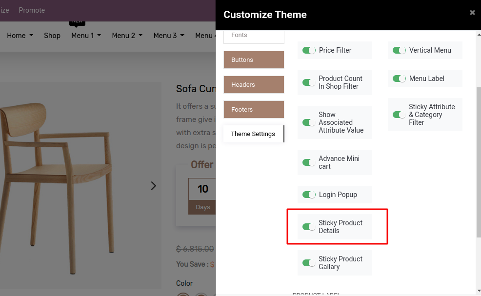
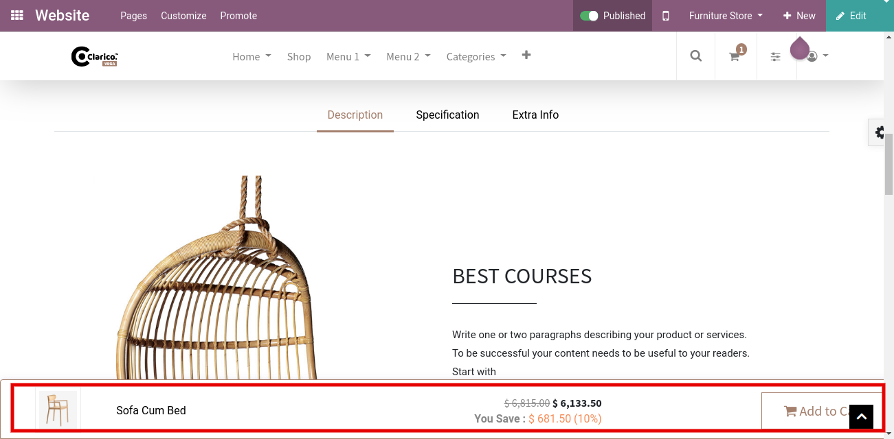

### Sticky Product Details

This feature sticks product details such as product image, price information at the bottom of the page with the **Add to Cart** button and **Buy Now** option. This feature allows customers to increase the efficiency of the cart to the items.

  
To enable/disable the Sticky Add to cart and Buy Now option functionality, go to Web Pages -> Customize -> Customize Theme -> Sticky Product Details. Once you enable that option, you can see the Product name, Price, Add to Cart button and Buy now button at the bottom of the product page.

