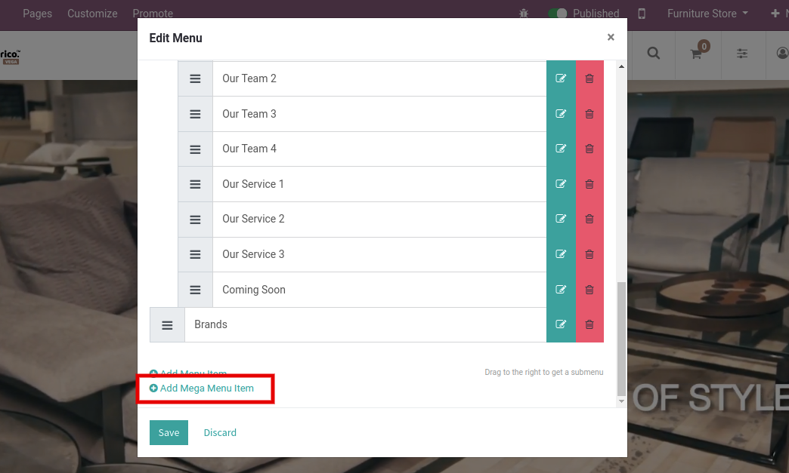
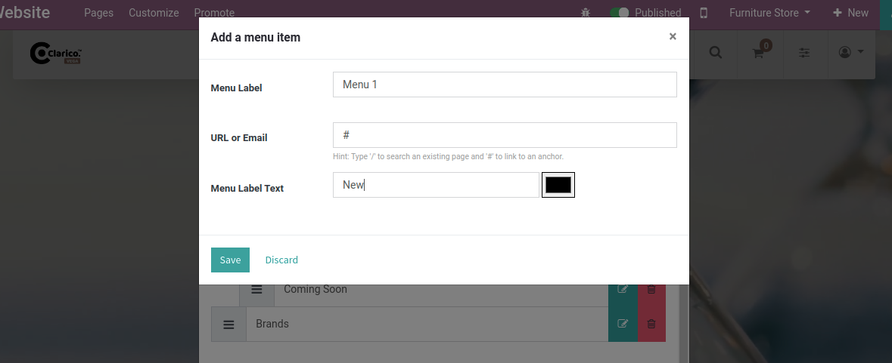

### Sync/Import Product from eBay to Odoo (Active Listing)

Seamless operations between eBay and Odoo will be one of the most important requirements for any seller. To make it efficient, first, we need to setup the product import process from eBay to Odoo.

{:.alert-info} 
> 
> #### TIP
> 
> Products in Active Listings at eBay will only be imported in Odoo. Products from Ended Listings cannot be imported into Odoo.
> 
> 
> 

Navigate to **eBay / Operations** and a pop-up will open in which you need to select the eBay Seller, Sites, and select Sync/Import Products in the eBay Operations field. As soon as it gets selected, additional options will be visible in the same pop-up. 

You need to set specific dates into from and to the date field. Also, you can synchronize the stock and price from here along with the products. 

Subsequently, you can also opt for Auto Create Product? if you want to create a new product in Odoo in case it is not found during this process. It will create the record of a new product in your Odoo while getting imported from eBay. Thus, the new product will be added successfully. Note that, this operation is optional.

 

Now, when we are importing the products from eBay, it will find and match the Product SKU between Odoo and eBay. Upon successful matching, it will fetch all the information from eBay and update it in Odoo. However, in some cases, if a Product SKU is not found the system will search for that particular product in Odoo. If it is found, the recent details get updated as usual.

If a Product is not found in Odoo and the auto create product is not checked, it will create a log that can be viewed from **eBay / Log Book / Operation Logs****.** 

All the matched products will be found in the eBay layer of Odoo under **eBay / Catalog / Products.** These products will be part of eBay Active Listings. You can access the Active Listings of the product of your eBay account at **eBay / Catalog / Active Listings** as shown below screenshot.

 

