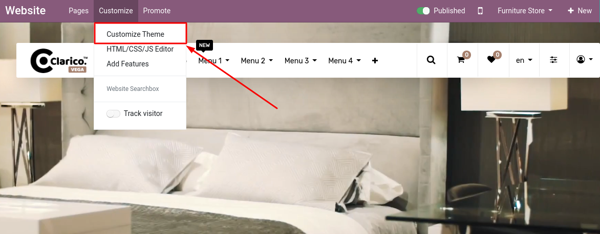

### Theme Customize

In the theme customize section, you can manage colours, layout, navbar, fonts and other theme-related configurations. Click on Customize menu from top website editor panel & click on Theme Customize button as per the below screenshot.

 

