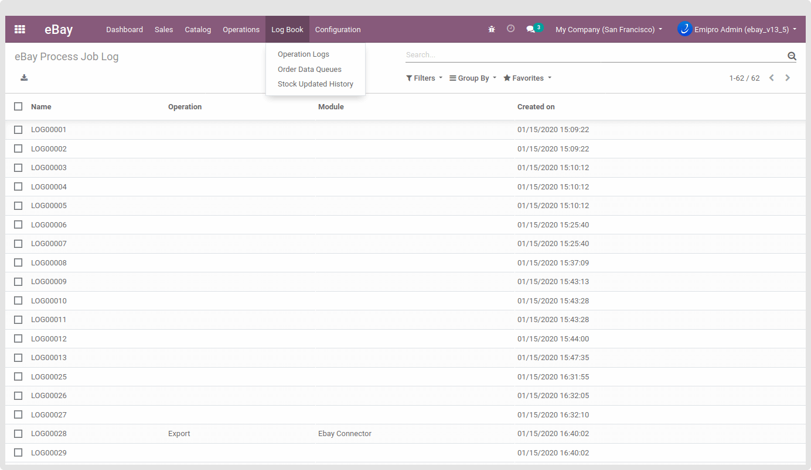

### Track eBay Process Job Log

Logs will be helpful when you strike any technical glitch while using the connector. It will let you know what and where things went wrong. For example, Import, Export, Update Operation, Missing Information, Wrong information fill-up, Not found information in Odoo, Missing configuration, API call limit over, etc. Even, there will be a reason mentioned by the system for unsuccessful Import/Export/Update operation so you can identify the actual problem.

  

You can access it from **eBay / Log Book / Operations Logs**.

 

