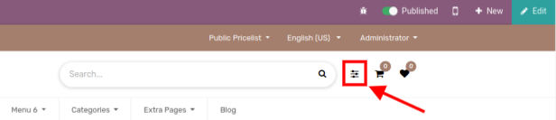
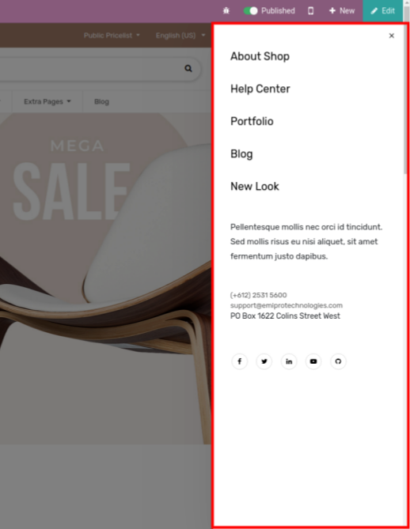

### Vertical Menu

* This feature provides you with one menu in the header section. It’s very handy when the user has multiple informative menus.
* To enable/disable the Vertical Menu, go to Web Pages -> Customize -> Customize Theme -> Theme Settings and enable Vertical menu as per the below screenshot.

After enabling this feature you can see the vertical menu icon at the header of the Website as per the below screenshot.

 

To edit the content of the vertical menu, click the vertical menu icon and go to the web  

page and click on the edit button in the top right corner of the web page and double  

click on the content to make changes as per your requirement.

