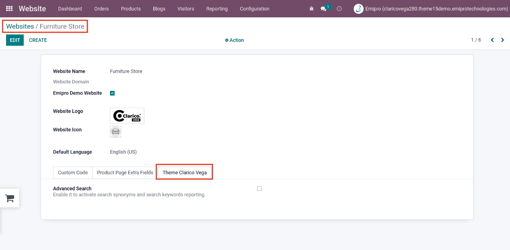
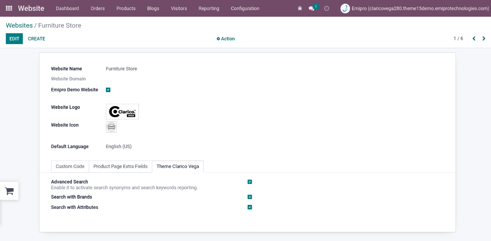

### Configuration

* To enable configuration, go to  **Website App -> Configuration -> Websites -> Select particular website record -> Theme Clarico Vega Tab**

*  Tick **Advanced Search Option** to enable the same and save the configuration
{:.alert-warning}
>#### Note
> Tick **Search with Brands** and **Search with Attributes** option to enable the respective search criteria
>

