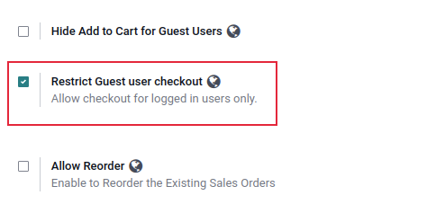
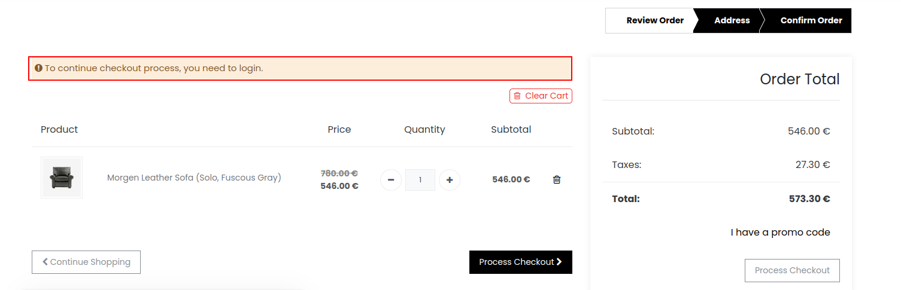

### Restrict guest user checkout

<iframe width="560" height="315" src="https://www.youtube.com/embed/1ngjbt_U9Pc" title="YouTube video player" frameborder="0" allow="accelerometer; autoplay; clipboard-write; encrypted-media; gyroscope; picture-in-picture" allowfullscreen></iframe>

By default, Odoo allows guest users to complete the checkout process without creating an account but with this feature, you can restrict them to complete the checkout process without login.

* **Step 1:** Go to the Website -> Configuration -> Settings

* **Step 2:** Select Restrict guest user checkout as shown below  screenshot

{:.alert-warning}
>#### Note
> If a website is not selected while creating a tab, It will be visible for every website in which the theme is installed.
>

Enabling this feature will redirect the guest user to the login page when they click on process checkout and after completing the log-in/registration process it will be redirected to the checkout page.

