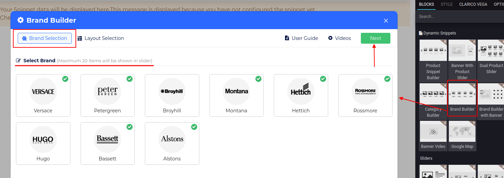
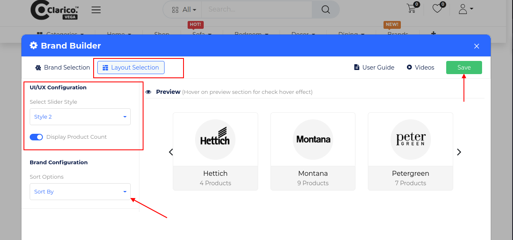
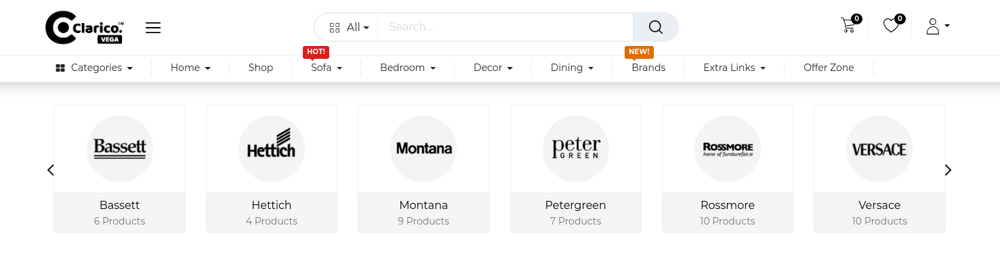

### Brand Builder

<iframe width="560" height="315" src="https://www.youtube.com/embed/iP5i1ERyGaI" title="YouTube video player" frameborder="0" allow="accelerometer; autoplay; clipboard-write; encrypted-media; gyroscope; picture-in-picture" allowfullscreen></iframe>

This dynamic snippet allows you to showcase the brands. To configure Brand Builder, go to the webpage where you want to configure the slider. Click on the ‘Edit’ button from the top right & drop the Brand Builder from the Dynamic Snippet portion as shown below screenshot.

Once drop the snippet, one configurational popup will be displayed where you need to select brands. In this popup, you can also load new brands for selection purposes. Click on the Next button for UI/UX configuration.

In the Layout Section, you can configure the slider style, sorting option as well as product count related configuration. You can visualize the slider's behaviour inside the preview section while changing the slider style. Click on 'Save' and save your changes from the web editor.

