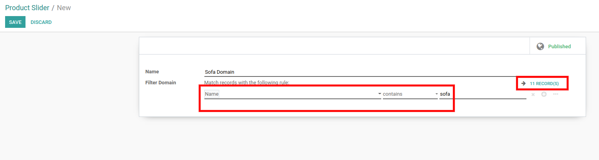
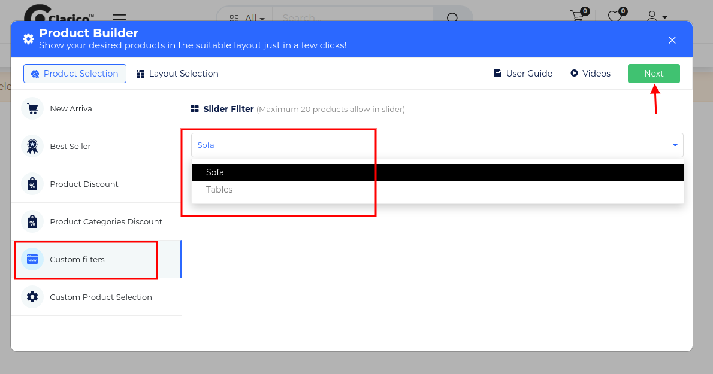

### Custom Filters

Product Snippet Builder providing the functionality to display products based on the Custom Product Filter where you can configure the custom domain on Products & display the products.

Steps to configure the Custom Domain Slider:

* **Step 1:** Go to the backend, **Website / Configuration / Product Sliders**& create a new record for a custom domain. Create one Ir Filter domain record as per the below screenshot.

 

* **Step 2:**In order to apply, open Website Editor from the Website & you can find the ‘Product Snippet Builder’ snippet inside Dynamic Slider. Once you select & drop that snippet, click on Custom Filter & select the Filter from the list as shown as below screenshot.

{:.alert-warning} 
> 
> #### NOTE
> 
> Layout Selection preview is same for all the styles of Product Snippet Builders ie. New Arrivals, Best Sellers, Product Discount, Product Categories Discount, Custom Filters, Custom Product Selection. Where you can configure UI/UX and Product Configuration. You can see the screenshot of Layout Selection in the New Arrival feature description.
> 
> 
> 

