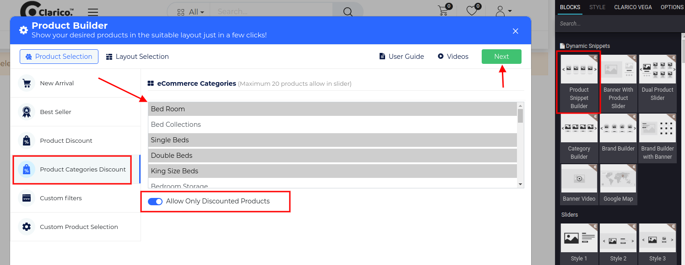

### Product Categories Discount

Product Snippet Builder providing the functionality to display those products which have configured product discount under the pricelist of the current website based on the eCommerce categories selection.

To configure **Product Snippet Builder - Categories Discount**, go to the webpage where you want to configure the slider. Click on the ‘Edit’ button from the top right & drop the Product Snippet Builder from the Dynamic Snippet portion and click on the Product Discount option as shown below screenshot.

You can see the list of eCommerce categories with a multi-selection option as shown in the above screenshot. You can select more than one category and check the discount option in case if you wanted to display based on the discount. Click on the Next button for Layout Selection purposes.

{:.alert-warning} 
> 
> #### NOTE
> 
> Layout Selection preview is same for all the styles of Product Snippet Builders ie. New Arrivals, Best Sellers, Product Discount, Product Categories Discount, Custom Filters, Custom Product Selection. Where you can configure UI/UX and Product Configuration. You can see the screenshot of Layout Selection in the New Arrival feature description.
> 
> 
> 

