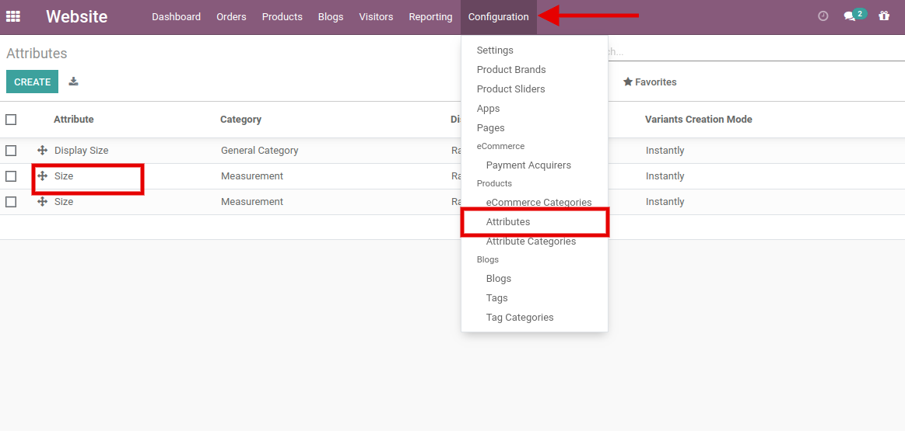
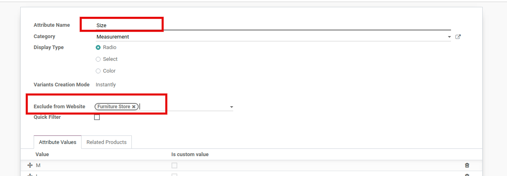
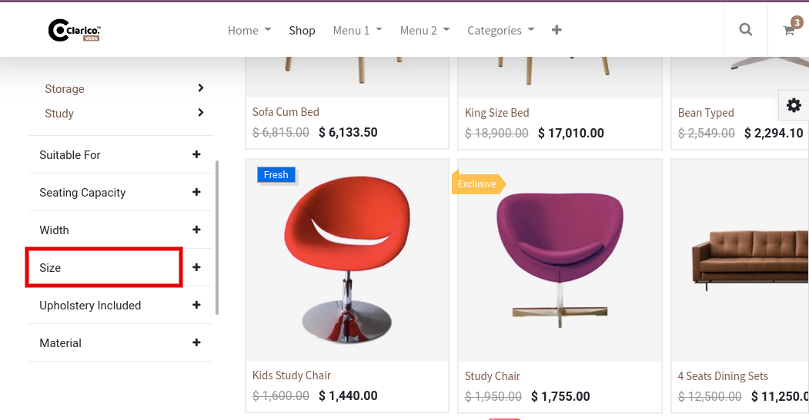
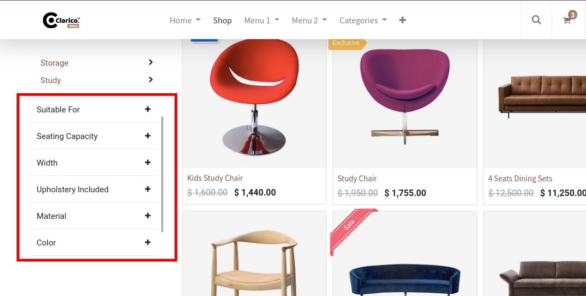

### Exclude Unnecessary Attributes From Shop Filters

<iframe width="560" height="315" src="https://www.youtube.com/embed/r3POFjhjuPU" title="YouTube video player" frameborder="0" allow="accelerometer; autoplay; clipboard-write; encrypted-media; gyroscope; picture-in-picture" allowfullscreen></iframe>

With the help of this feature, you can exclude any attribute from the Attribute Filters list. If you want to hide any specific attribute from a specific website, then you can easily exclude that filter.

 

 

 

After this configuration, Size attribute will not display in the Furniture Website Attribute listing.

 

 

Before excluding the Size attribute in the Furniture store.

 

After excluding the Size attribute in the Furniture store.

