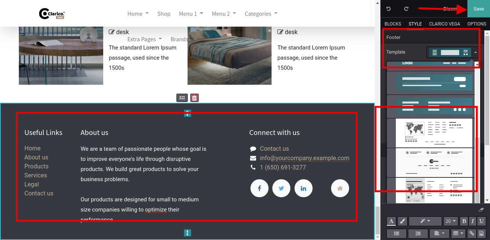

###  Change Footer Style

* To change the footer style, open Website Editor from the Website & click on the Footer portion. Once you select the footer, you can see the dropdown of available footer options as shown as below screenshot. Select the appropriate theme footer and save the changes.

 

