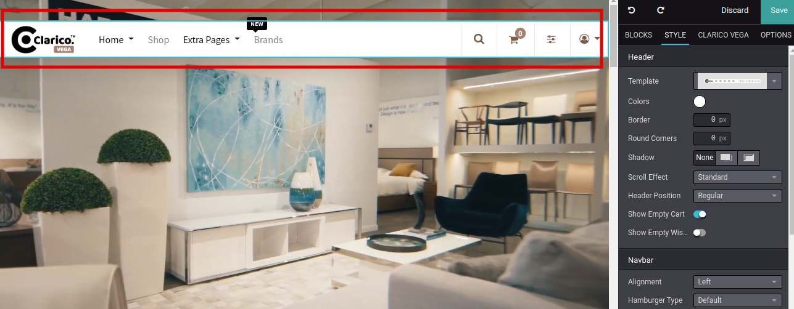
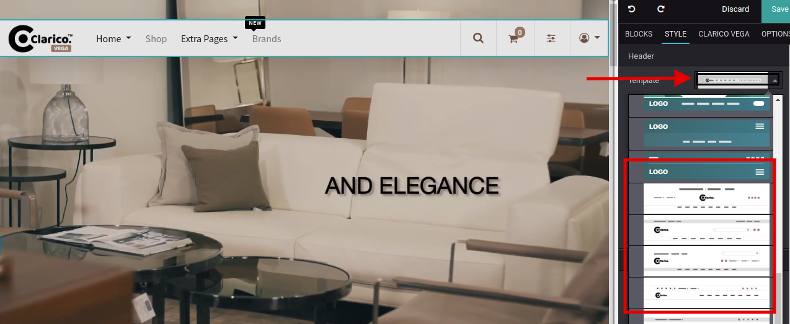
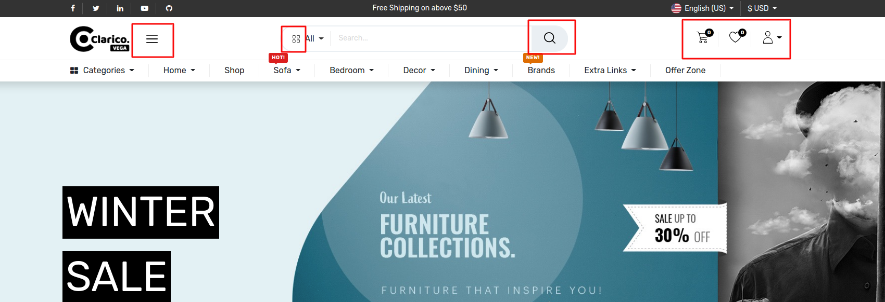

### Change Header Style

To change the header style, open Website Editor from the Website & click on the **Header** portion as shown below screenshot.

 

* From the Header customize option, you can see the dropdown of available header option as per the below screenshot. Select the theme header and save the changes.

 

 

{:.alert-warning} 
> 
> #### NOTE
> 
> If you are using Custom Header Style number 10 and wants to update any icon like Vertical Menu, Category Selection, Search, Wishlist, Shopping Cart, User icon then you have to followed below steps:
> 
> 
> * Go to theme\_clarico\_vega/static/src/img/header\_icons inside the theme folder
> * You can find all the icons image which mentioned above
> * Replace with your new image with same size and height
> * Check the Header behaviour after restarting the server
> 
> 
> 

 

