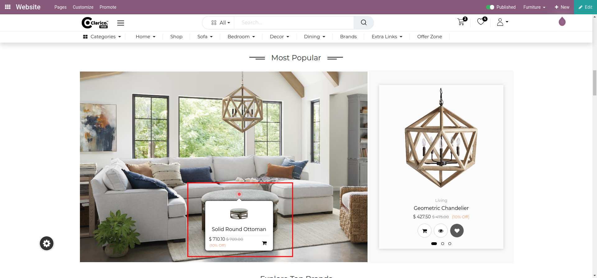

### Hotspot

<iframe width="560" height="315" src="https://www.youtube.com/embed/ErbNoqllSfI" title="YouTube video player" frameborder="0" allow="accelerometer; autoplay; clipboard-write; encrypted-media; gyroscope; picture-in-picture" allowfullscreen></iframe>

Hotspot providing the functionality to showcasing the products section with various options to directly add to the cart. Also, provide an option to highlight the offers on a separate page.

To configure Hotspot - Go to the webpage where you want to configure the Hotspot. Click on the ‘Edit’ button from the top right & drop the “Banner With Product Slider” or “Full Image” snippet Here we drop “Banner With Product Slider” snippet and select the image and click on “Configure Hotspot”, Popup window will open as shown below screenshot.

 

Hotspot configuration option selected by default on a popup window with this option you can configure below sub-option.

* Hotspot Action type: Set on click or on hover to trigger hotspot an action.By default hotspot action trigger on click.
* Hotspot Action: Set any hotspot action from the drop-down selection as per your need. Based on selection next input will display to configure the page URL or product

Click on “Hotspot UI Configuration” to configure the layout options. Also, Get a preview of the layout on a dummy image as shown below screenshot.  

 

 

* Hotspot Shape: Set any hotspot shape from the drop-down selection which suits you as per your overall theme layout.
* Hotspot Color: Pick any hotspot color from the color picker and set which suits you as per your overall theme layout
* Hotspot Animation: Set any hotspot animation from the drop-down selection which suits you as per your overall theme layout.

Finally, Save your Configuration by clicking on the Save button, You will get a hotspot on a banner image at the center position you can select & drag to set a hotspot on any position on the banner image.

To edit hotspot configuration, Again select hotspot and click on  “Configure Hotspot” button and you will get old per fill configuration.

 

