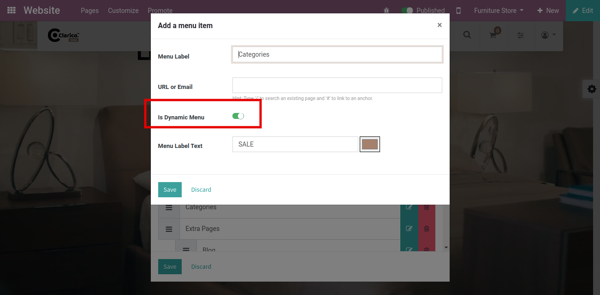
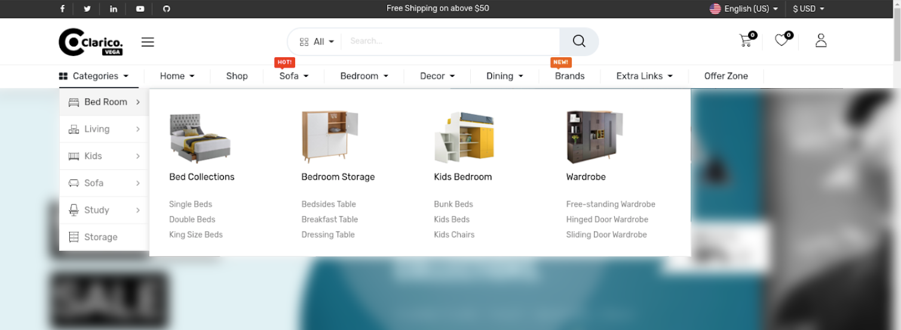
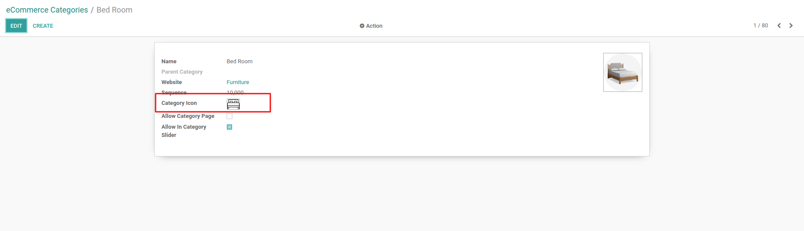

### How To Enable Dynamic Category Menu?

* To enable the dynamic category menu, Go to **Web Pages / Pages / Edit** menu and edit the menu which you want to set as a dynamic category menu.

 

* As shown in the above screenshot there is one option to enable/disable the dynamic category menu. After enabling this option, this menu will show a list of categories dynamically with the category image as per the below screenshot.

* As you can see in the above screenshot, all the parent catergories of current website listed horizontally with category icons. When you hover on that specific category, you can see the child category with its image & its sub categories.
* For update the parent category website icon, go to Odoo backend Ecommerce Category view & update the image as per the below screenshot.

{:.alert-warning} 
> 
> #### NOTE
> 
> * Its advisable to always place your Dynamic Category Menu as a first position in Header as per the screenshot in order to get proper user interface.
> * **Recommended image resolution:** Parent Category Website Icon- 14 X 12 and Sub Category Image- 118 X 118.
> 
> 
> 

