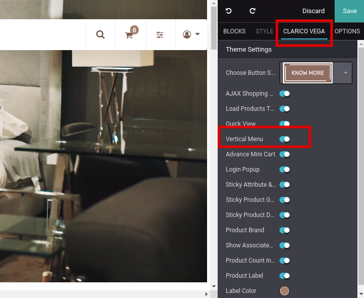
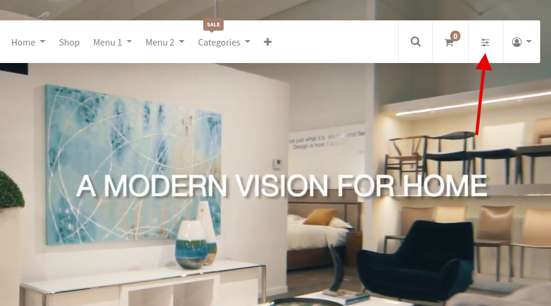
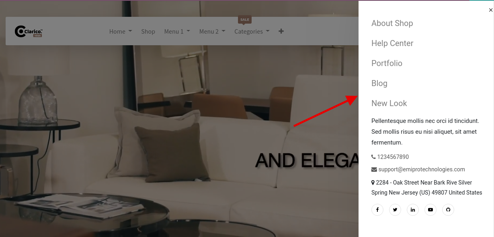

### Vertical Menu

* This feature provides you with one menu in the header section. It’s very handy when the user has multiple informative menus.
* To enable/disable the Vertical Menu, open Website Editor from the Website & click on **Clarico Vega** as shown in the below screenshot.
* You can find the option for enable/disable the vertical menu from that configuration as per the below screenshot.

 

After enabling this feature you can see the vertical menu icon at the header of the Website as per the below screenshot.

 

 

 

