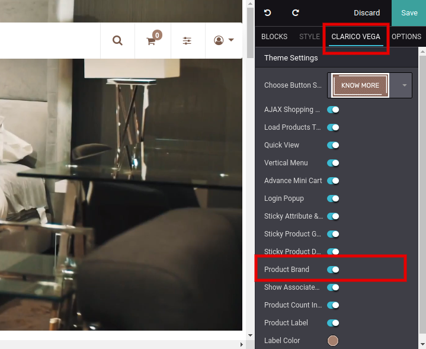
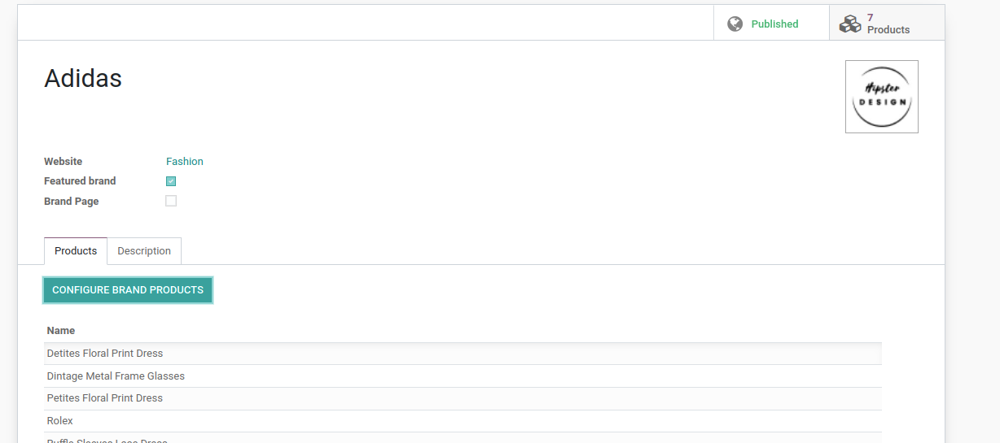
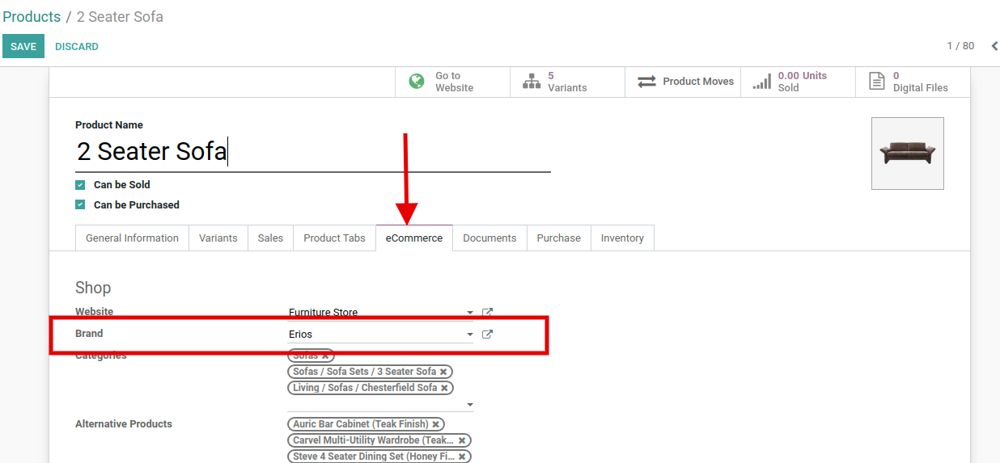
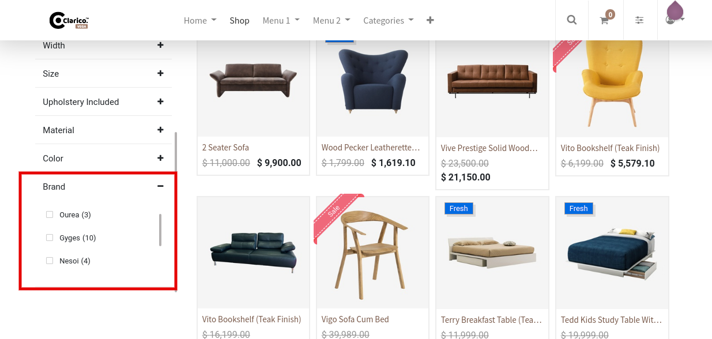
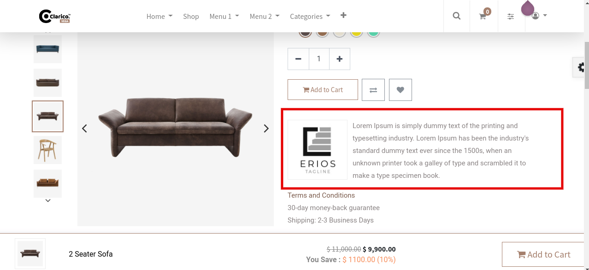

### Product Brand

To enable Product Brand, open Website Editor from the Website & click on **Clarico Vega** option. You can find the Product Brand option as shown as below screenshot. Enable that option & save the changes.

 

In the admin side, go to **Website / Configurations / Product Brands**. You can configure the brand details as well as can assign products as shown as below screenshot.

 

 

As shown in the screenshot, Fill up the details of your brand and it will be preferable to upload the logo size 130 X 130px. Also, don’t forget to publish the brand. After creating a brand, go to the product view and assign it to the product. Save the changes.

For configure brand in product record, open that product in admin backend view & assign brand as shown as below screenshot.

 

 

Brands filter in Shop page after attribute listing.

 

 

 

