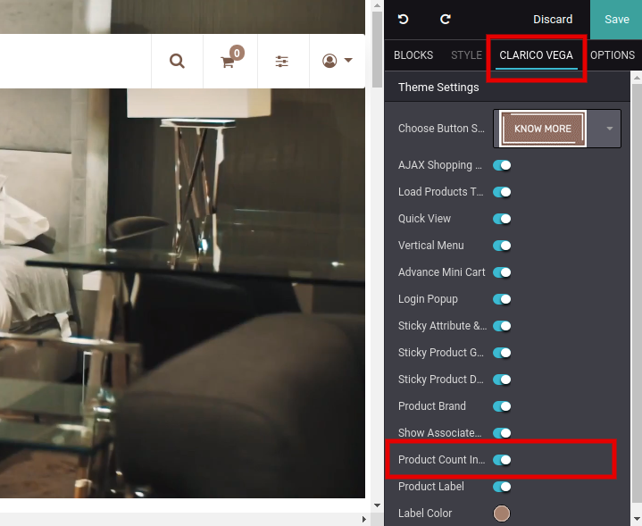
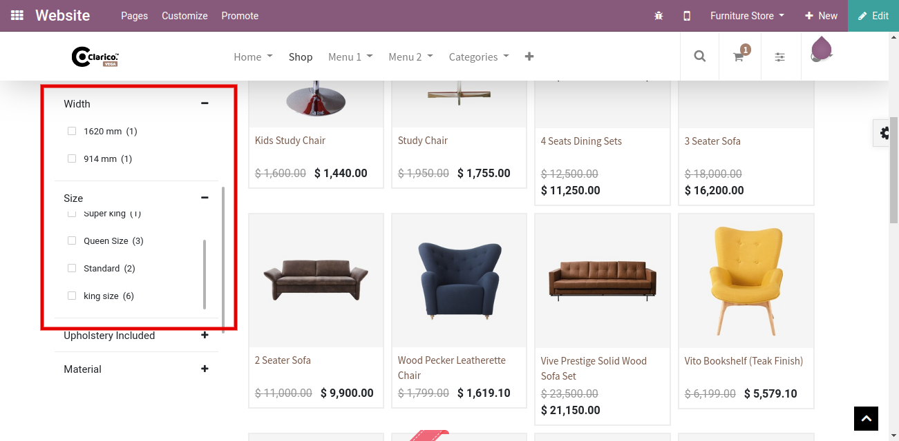

### Product Count In Shop Filter

<iframe width="560" height="315" src="https://www.youtube.com/embed/M8sU0hi_4OA" title="YouTube video player" frameborder="0" allow="accelerometer; autoplay; clipboard-write; encrypted-media; gyroscope; picture-in-picture" allowfullscreen></iframe>

This feature displays the associated product count in the Attribute listing. To enable Product Count in Shop Filter, open Website Editor from the Website & click on Clarico vega option. You can find the product Count in Shop Filter option as shown in the below screenshot. Enable that option & save the changes.

 

 

 

 

After enabling this option, you can see the count of Products in Attribute listing as per the below screenshot.

