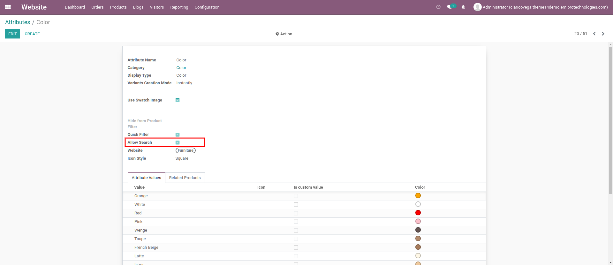
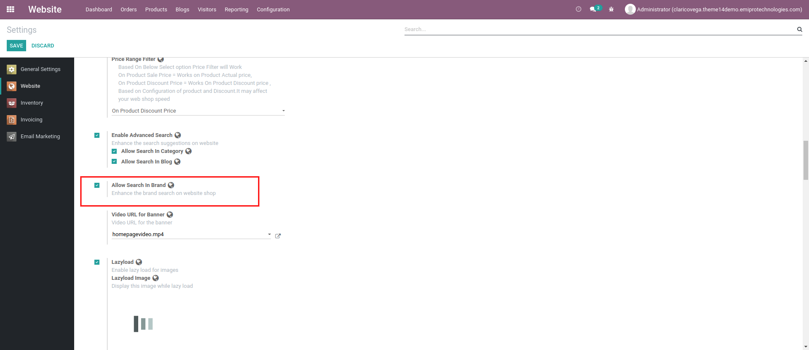
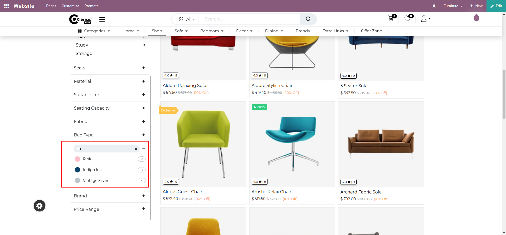
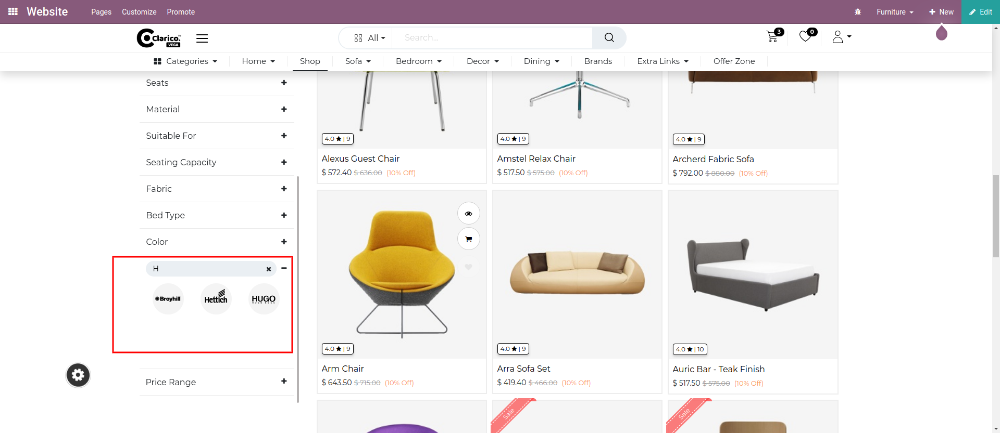

### Search in Attribute filter & Brand filter

**This feature makes easy to use the products attributes filter and brand filter by providing a search option based on the configuration.**  

  

**Configuration**

* **Search in attribute filter**

	+ **In the admin user, go to Website / Configurations / Attribute and click on any attribute that must not be a select type and enable the ‘Allow Search’ option, and save the configuration as per the below screenshot.**
* **Search in a Brand filter**

	+ **For Enabling search option in the brand filter, Go to Website / Configuration / Settings. Select your website, in which the theme clarico vega is installed. You can find one settings panel named 'Emipro Theme Settings'. As per the below screenshot, Enable the ‘Allow Search In Brand’ and save changes**

**Go to the website shop page, the search option will be displayed as per the configuration**

