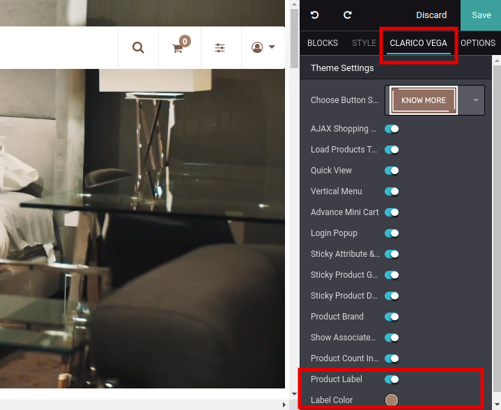
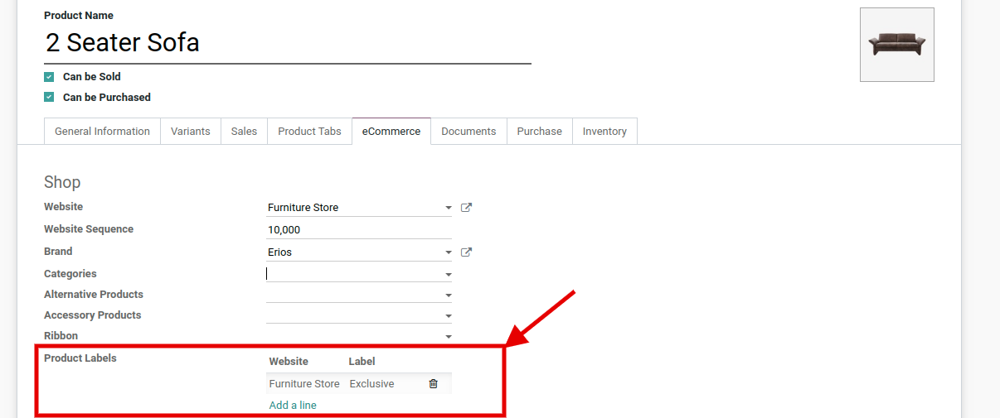
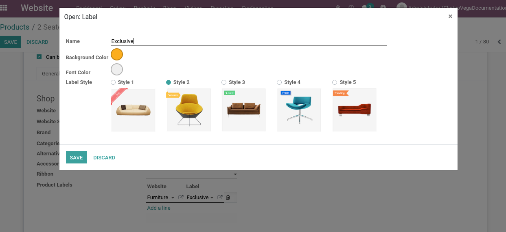
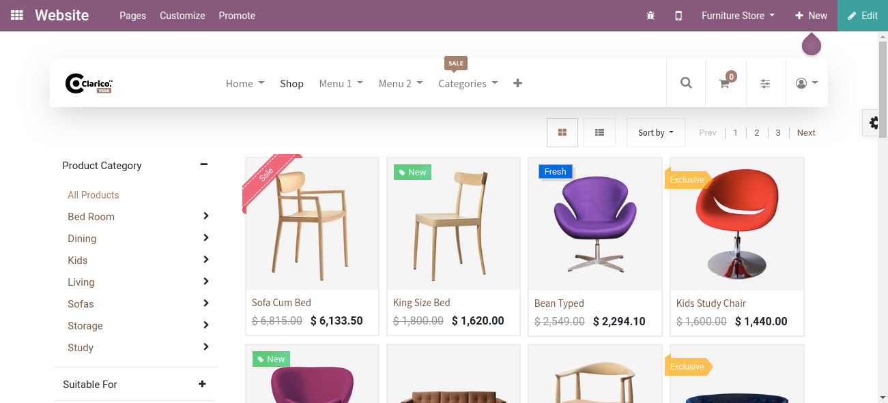

### Product Label

<iframe width="560" height="315" src="https://www.youtube.com/embed/KK_OmnYj8MQ" title="YouTube video player" frameborder="0" allow="accelerometer; autoplay; clipboard-write; encrypted-media; gyroscope; picture-in-picture" allowfullscreen></iframe>

* To enable Product label, open Website Editor from the Website & click on **Clarico Vega** option. You can find the Product Label option & can enable it with default background colour of  label as shown below screenshot.

 

Steps to configure the product label:

 

* **Step 1:** Open the product records in the backend admin side. You can see the ProductLabeloption inside the eCommerce tab as shown in the below screenshot. Where you can you can configure the product label with different styles as well as custom color based on the websites.

 

 

As per the above screenshot, you can customize the Product label also.

 

