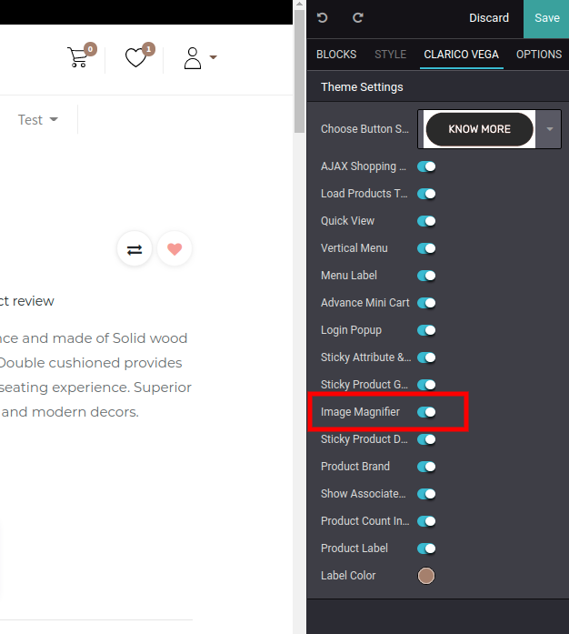
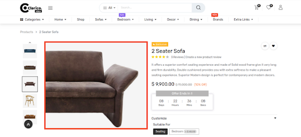
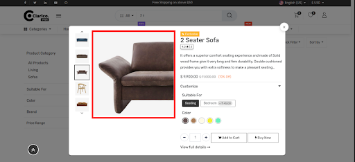
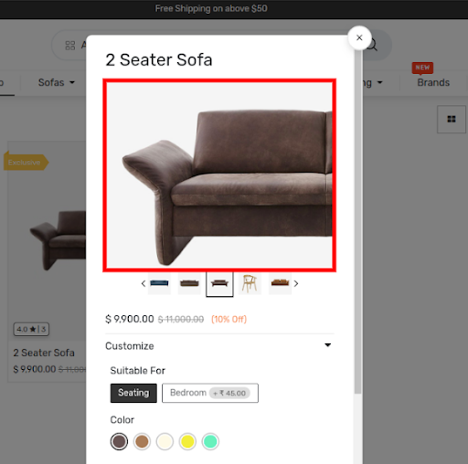

### Image Magnifier

* Image Magnifier provides the product image magnifier functionality that will hover the product image on the product page, Quick View and Ajax Add to cart popup. Product appearance is always the top priority of eCommerce websites, since it will have a positive impact on the consumer's mind.
* To enable/disable the Image Magnifier, open Website Editor from the Website & click on Clarico Vega tab & enable/disable the configuration ‘Image Magnifier’ as shown in the below screenshot.

 

* Product Page

* Quick View

* Ajax Add to Cart

