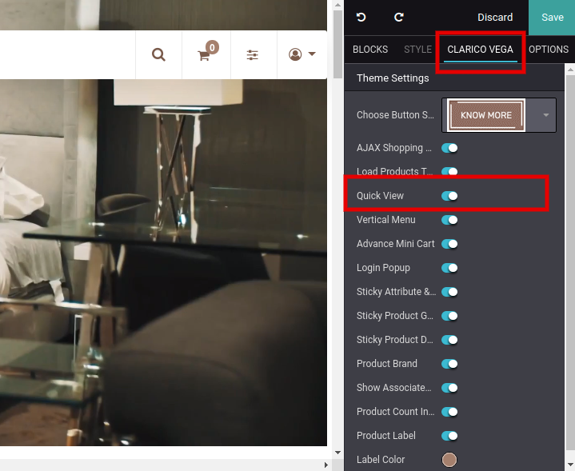
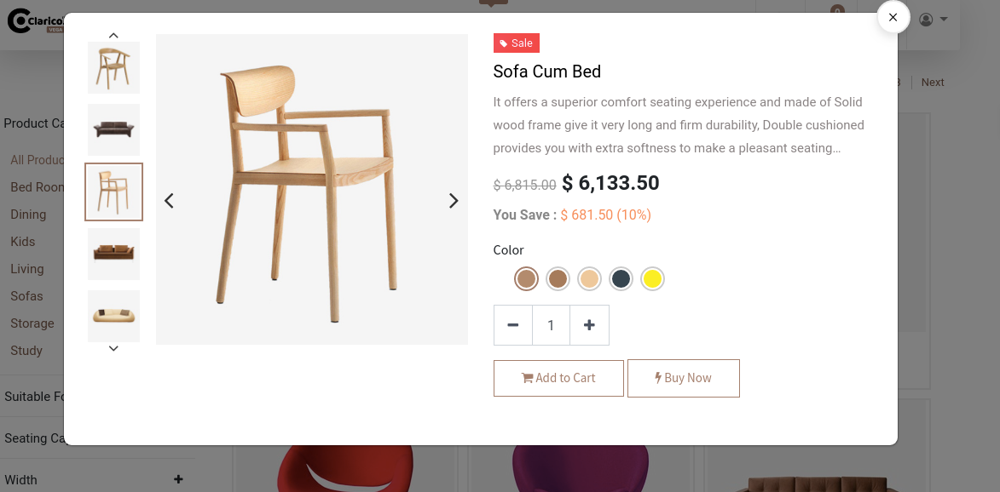
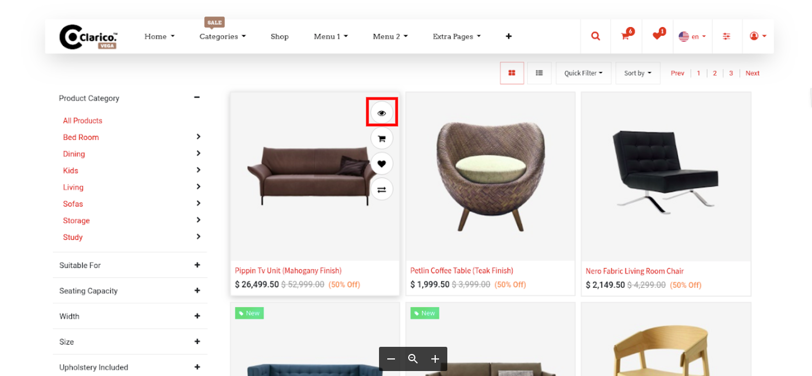

### Quick View

<iframe width="560" height="315" src="https://www.youtube.com/embed/DWmFQhMfYwg" title="YouTube video player" frameborder="0" allow="accelerometer; autoplay; clipboard-write; encrypted-media; gyroscope; picture-in-picture" allowfullscreen></iframe>

Once you enable that option, you can see the Quick view icon in the New product slider, Bestseller, all offers snippets and other product sliders having dynamic snippet.

To enable Quick View, open Website Editor from the Website & click on Clarico vega option. You can find the Quick View option as shown as below screenshot. Enable that option & save the changes.

 

 

 

