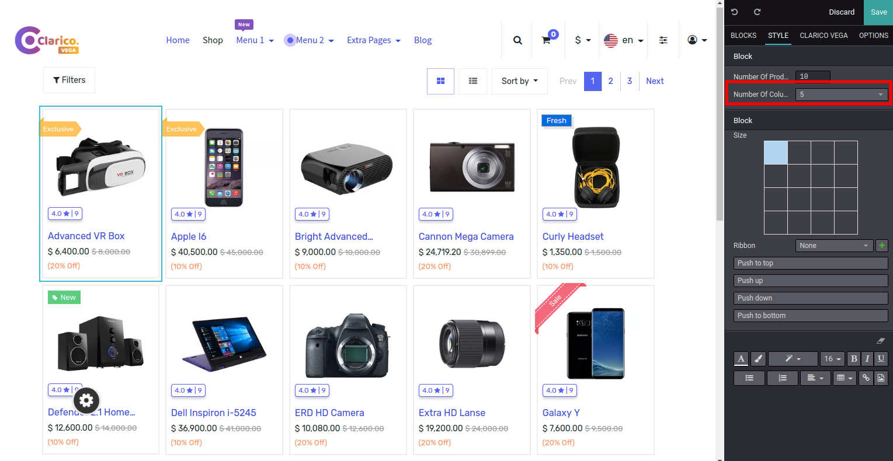
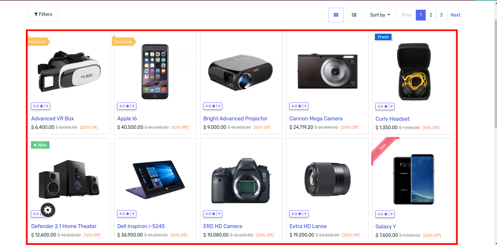

### 5-6 Column Grid View In Shop Page

In the Shop Page, the user can now set upto six columns of products in a row. Odoo provides 3 options by default (2,3,4), and we have extended that up to 6.

Steps to configure 5-6 Column Grid View In Shop Page:

* Step 1: Go Shop Page and then click on the edit button to open the Website Editor.
* Step 2: Click any of the Products and from the Editor click on the Number Of Columns and set as per your need.

* Step 3: Save & Check the Shop Page.

{:.alert-warning} 
> 
> #### NOTE
> 
> It is more preferable to use the Filter In Sidebar option in grid view if you have 5 - 6 columns. As a result, all product images look great.
> 
> 
> 

