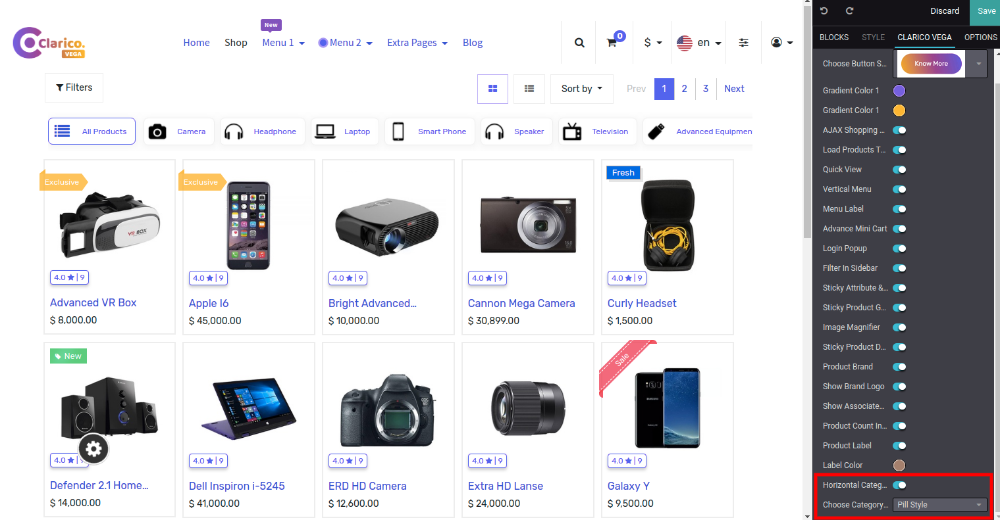
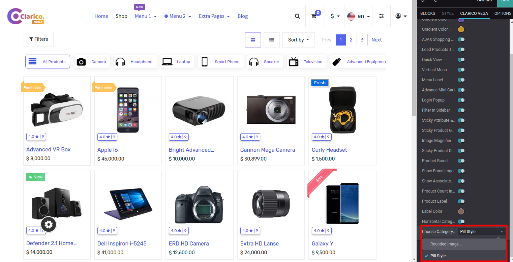
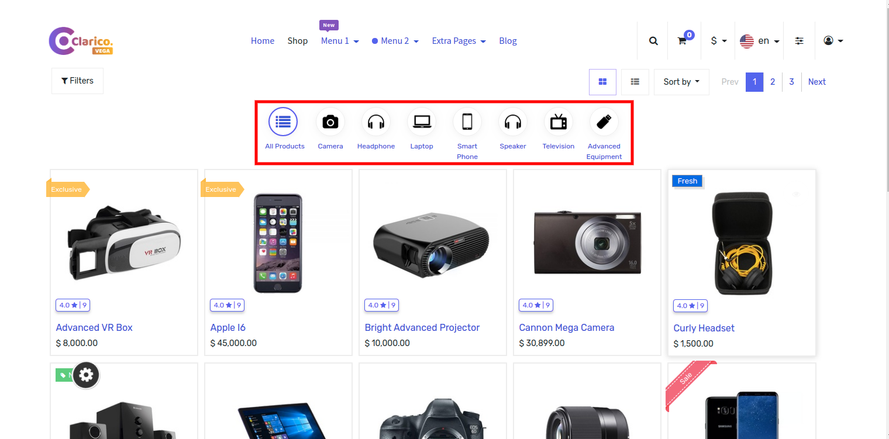
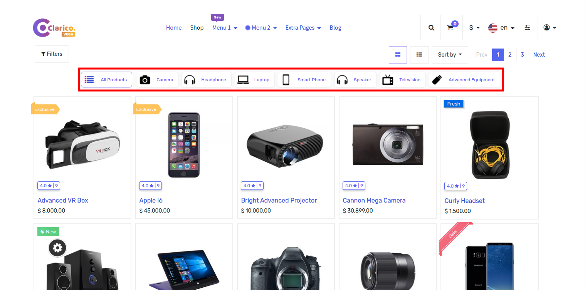

### Horizontal Category Bar

Display the Main parent eCommerce category on the shop page horizontally without opening the filter section. The horizontal category section allows you to search the products by category.

Steps to configure Horizontal Category In Shop Page:

Step 1: Go Shop Page and then click on the edit button to open the Website Editor.  

Step 2: Click on Clarico Vega Tab and click on the Horizontal Category option from Editor.  

 

Step 3: After enabling the Horizontal Category option you need to Choose Category Style default style Is Rounded Image Style.  

 

Step 4: Click on Save and reload the Shop Page you can see the Horizontal Category options as below.

Horizontal Category Style Rounded Image  

 

Horizontal Category Style Pill  

 

