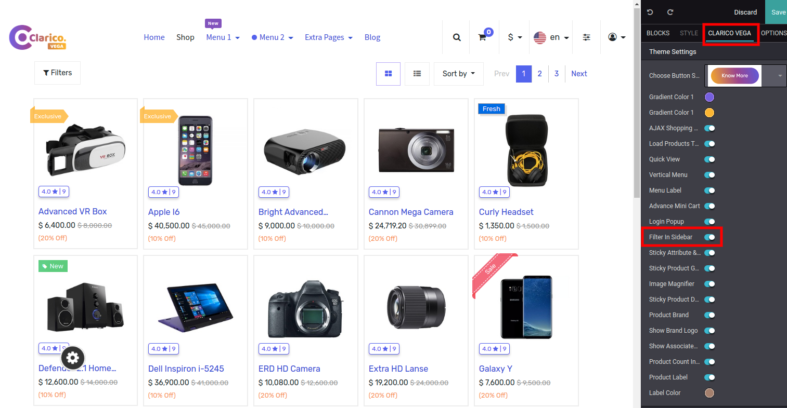
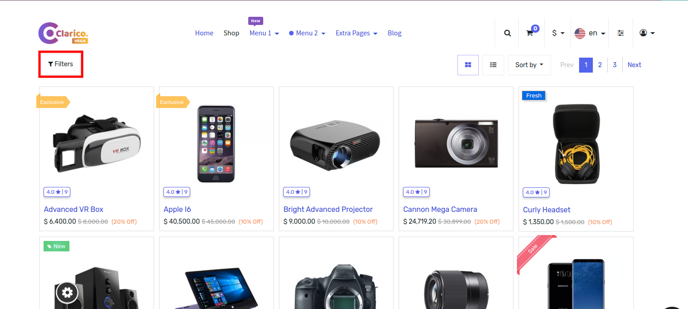
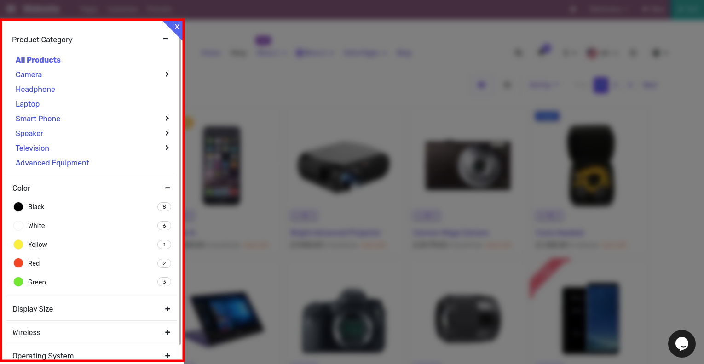

### Shop Sidebar Attribute Filters

Display all product attributes on a sidebar, and on the shop page you can display up to six products in one single row.

Steps to configure Shop Sidebar Attribute Filters In Shop Page:

* Step 1: Go Shop Page and then click on the edit button to open the Website Editor.
* Step 2: Click on Clarico Vega Tab and click on the Filter In sidebar from Editor.

* Step 3: Click on Save and reload the Shop Page, So doing this way you can enable and disable that option.

When you click on the Fitler it will look like below.

