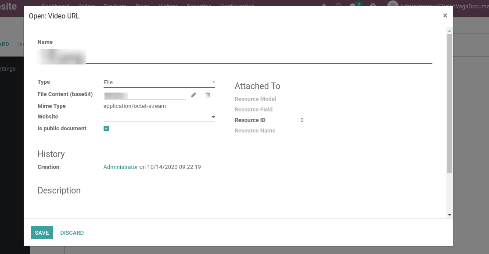

### Banner Video

We have provided a feature in our theme where you need to do basic configuration, and then you can easily add a video to your website through the Banner Video Snippet.

{:.alert-error} 
> 
> #### WARNING
> 
>  Right now video banner is not supporting web-site wise configurations and it will support below formats.
> 
> 
> 

Steps to configure the Banner Video snippet:

* **Step 1:** Go to backend **Website / Configuration / Settings**. Inside Emipro Theme Settings tab, you can see an option to configure video (as an attachment) in order to display in the website via a snippet.
* Create or assign the attachment record as per the below screenshot & save the configuration page.

 

 

In order to apply the video banner, go to website & open Website Editor from the top right Edit button. You can see a Video Banner snippet inside the Dynamic Snippet portion. Drag & drop that snippet in your web page & save the changes.

Right now, the video banner does not support web-site wise configurations and will support formats below.

1. Mov
2. Mkv
3. Mp4
4. WebM

