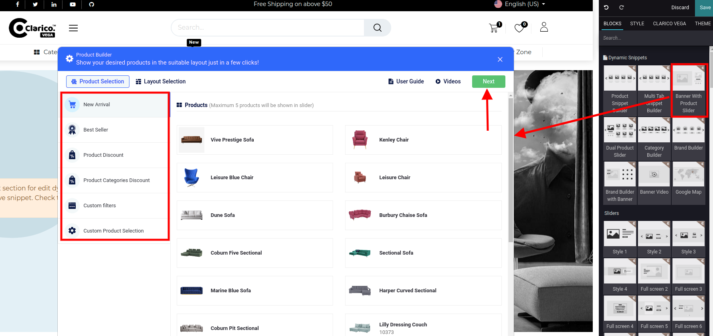
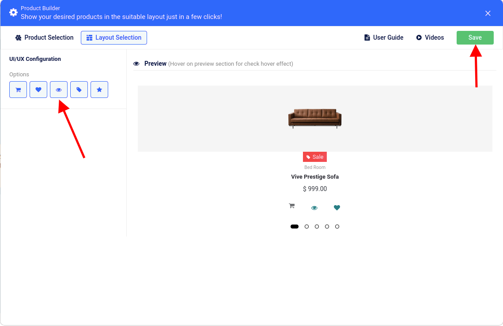
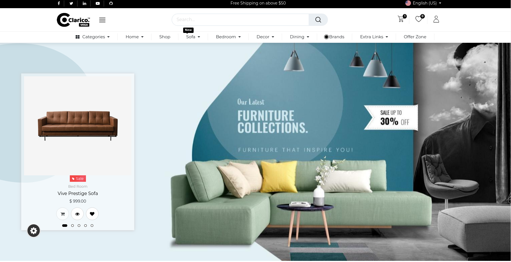
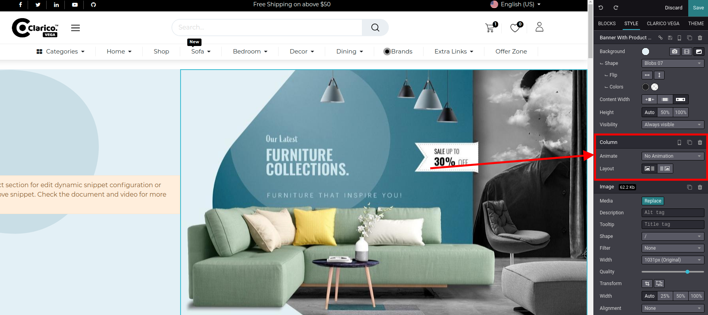

### Banner With Product Slider

Banner With Product Slider providing the functionality to showcasing the products with various layout options and also providing the functionality to display Banner image.

To configure **Banner With Product Slider**, go to the webpage where you want to configure the slider. Click on the ‘Edit’ button from the top right & drop the Banner With Product Slider snippet from the Dynamic Snippet portion as shown below screenshot.

Once you drop the slider, the Product Builder Configuration Popup will be displayed as you can see in the above screenshot. Where you can select any options like New Arrivals, Best Sellers, Product Discount, Product Categories Discount, Custom Filters and Custom Product Selection.

Click on the Next button after configure the appropriate option and products. In the Layout section, you can configure the slider's layout-related configuration. In UI/UX configuration, you can configure the display options like Add to Cart, Wishlist, Quick View, Sale Lale & Rating options as shown in the below screenshot. You can visualize the slider's behavior inside the preview section. Click on 'Save' and save your changes from the web editor.

 

{:.alert-warning} 
> 
> #### NOTE
> 
> As you can see in the above screenshot, the Product slider is configured on the left side and the right side banner configured. This direction you can change as per your requirement from the Website Editor as mentioned in the below screenshot. So you can also use the Website Editor's functionality with this dynamic snippet for providing a great showcase to your website.
> 
> 
> 

 

