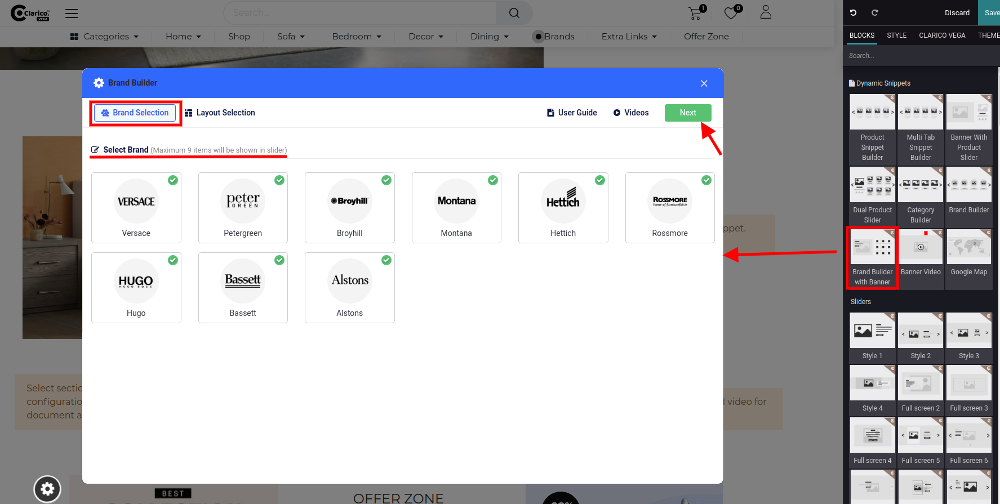
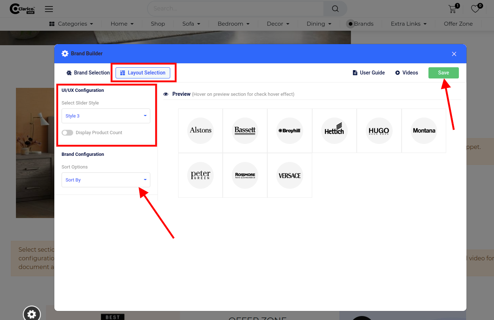
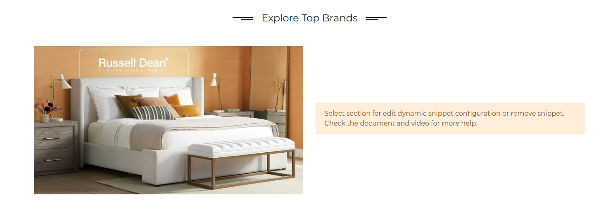
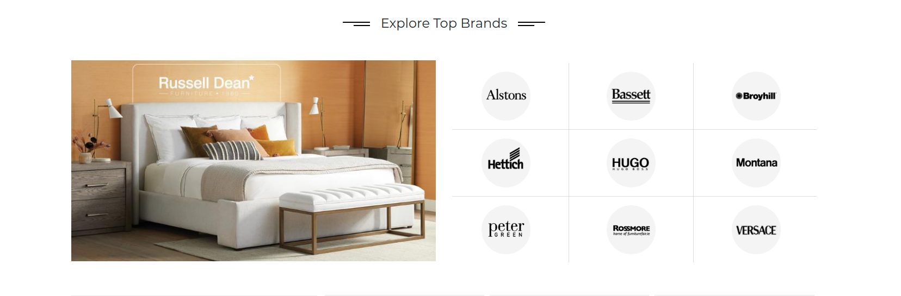

### Brand Builder with Banner

This dynamic snippet allows you to showcase the brand slider with the banner on the website. To configure Brand Builder with Banner, go to the webpage where you want to configure the slider. Click on the ‘Edit’ button from the top right & drop the Brand Builder with Banner from the Dynamic Snippet portion as shown below screenshot.

Once drop the snippet, one configurational popup will be displayed where you need to select brands and click on the 'Next' button for UI/UX configuration.

In the Layout Section, you can configure the slider style, sorting option as well as product count related configuration. You can visualize the slider's behaviour inside the preview section while changing the slider style. Click on 'Save' and save your changes from the web editor.

This is the preview of the Brand Builder with Banner dynamic snippet. With the help of different Title Snippets of theme, you can also display the attractive title on the top of any dynamic slider as shown in the above screenshot.

