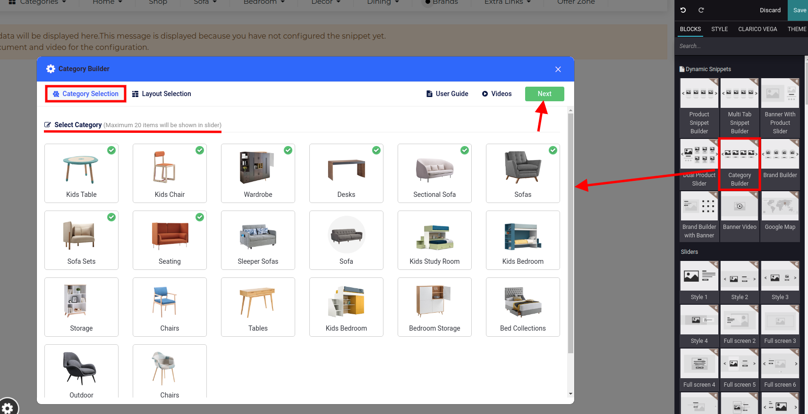
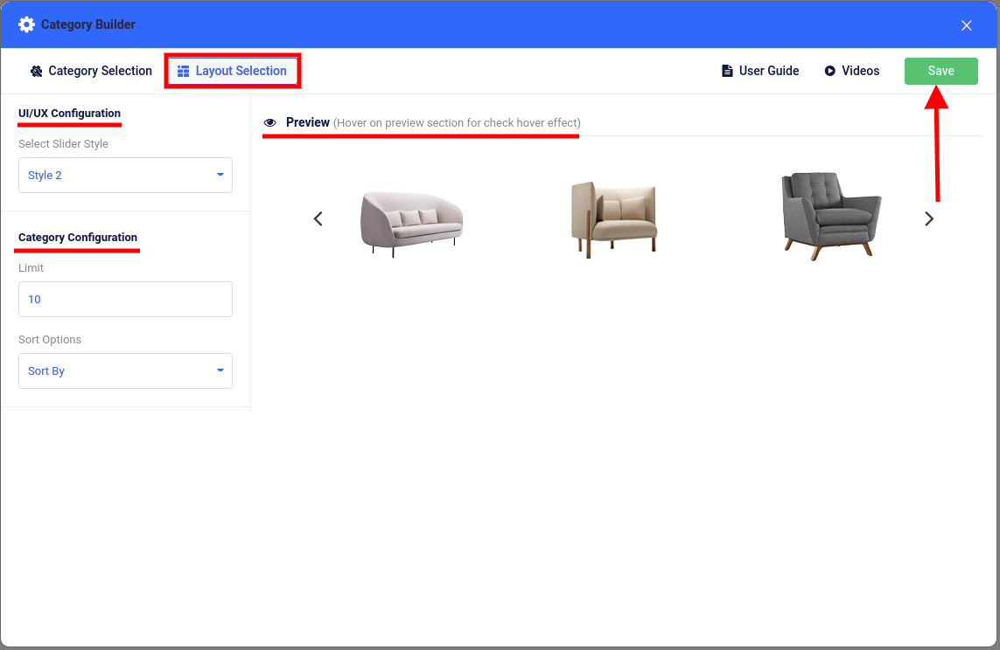
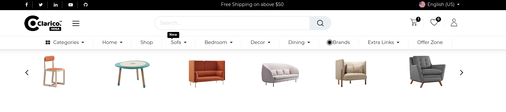

### Category Builder

This dynamic snippet allows you to showcase the eCommerce categories. To configure Category Builder, go to the webpage where you want to configure the slider. Click on the ‘Edit’ button from the top right & drop the Category Builder from the Dynamic Snippet portion as shown below screenshot.

Once drop the snippet, one configurational popup will be displayed where you need to select categories. In this popup, you can also load new categories for selection purposes. Click on the Next button for UI/UX configuration.

In the Layout section, you can configure the slider style, sorting option as well as category limit configuration. You can visualize the slider's behavior inside the preview section while changing the slider style. Click on 'Save' and save your changes from the web editor.

