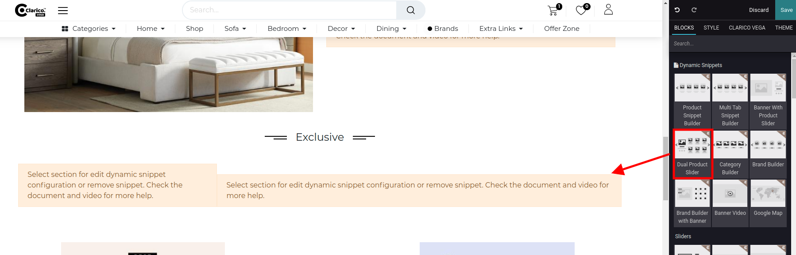
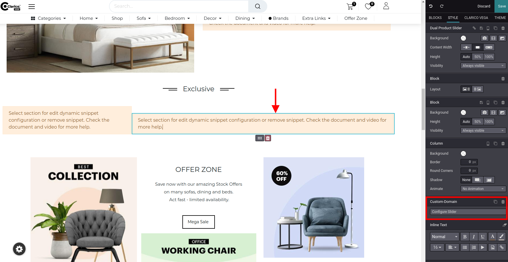
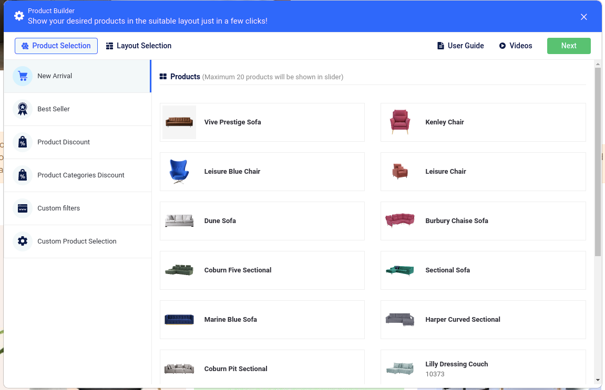
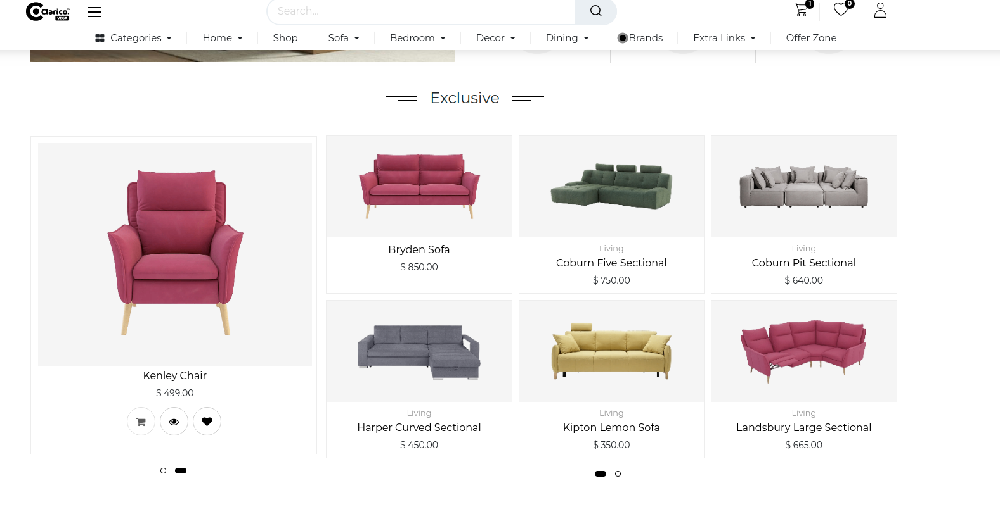

### Dual Product Slider

Dual Product Slider providing the functionality to showcasing the products with dual layout listing. Where you can configure dual product sets into a single element.

To configure **Dual Product Slider**, go to the webpage where you want to configure the slider. Click on the ‘Edit’ button from the top right & drop the Dual Product Slider from the Dynamic Snippet portion as shown below screenshot.

Once you drop the snippet, you can see two snippet editor message as mentioned in the above screenshot. For the slider confliguration, click on the snippet editor message. Once you click in that portion, you can see the snippet option inside the Web Editor as per the below screenshot.

As you can see in the above screenshot, once you click on the snippet editor message, you caqn click on the Configure Slider from the Snippet Editor options. Once you click on that option, Product Snippet Builder popup will be displayed and you can process the further configuration as mentioned in **Product Snippet Builder**.

 

