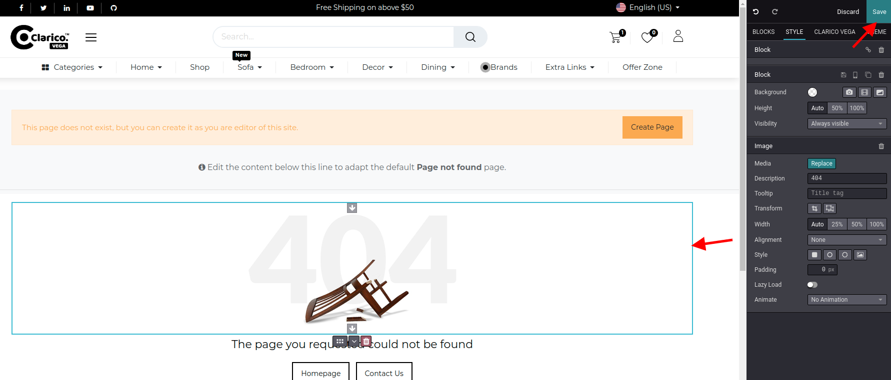

### How to change 404 Background Image?

To change 404 page's background image, open 404 page in your website and open Website Editor from the top right 'Edit' button & click on the current image in order to update. Once you update the image then click on the save button from top right as shown as below screenshot.

