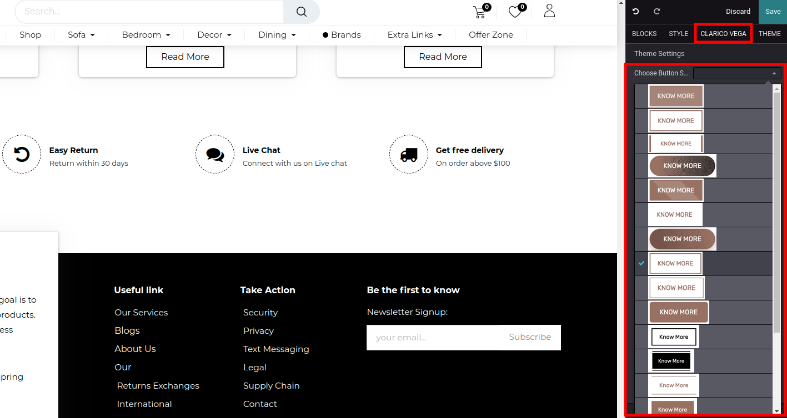

### How To Change Button Style?

* To change the button style, open Website Editor from the Website & click on Clarico vega option as shown in the below screenshot. You can find the Choose Button Style option & enable appropriate style and save the changes.

* Button style 16 only for the gradient, in that we use Extra Color-2 and Extra Color-3 as per the screenshot above. You need to set up your gradient color in the Extra Colors option.

 

