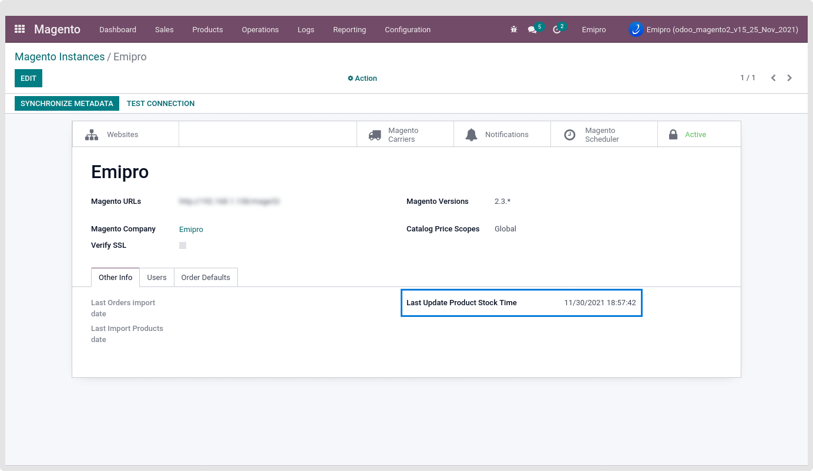

### Export Product Stock

Based on your configuration of the Magento Instance there are two different ways to Export the Product stock from odoo to Magento.

If you are performing this operation the first time, then the product stock will be exported from odoo to Magento only of those products in which stock movement has been done in the last 365 days.

The last Exported Stock date will be visible under the Instance.

 

By default this field’s value is blank.

* Once First time operation is done then, Its set date and time of perform operation date.

* After that every time, when performing export product stock operation via operation wizard or scheduler action then product stock will be counted and exported based on stock movement between last export product stock data and current date.
* Product Stock Exported based on the “Magento Stock field” configuration the total product stock of all the configured warehouse

