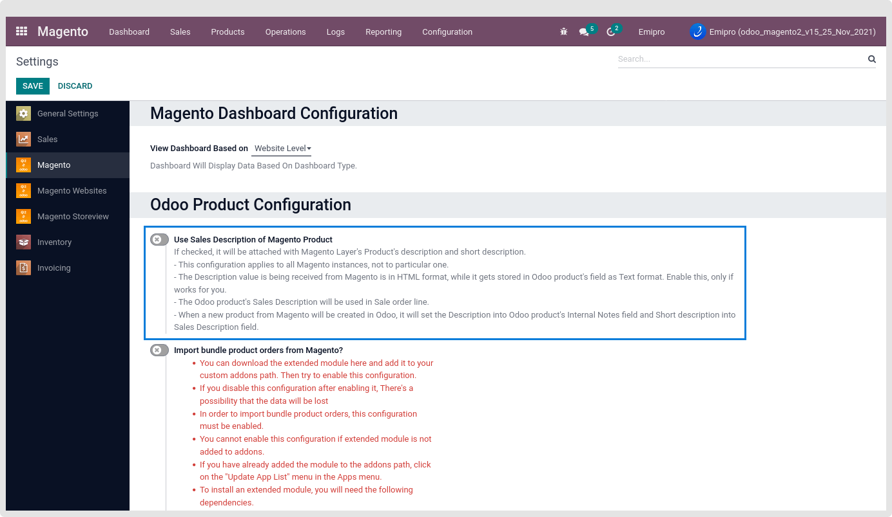
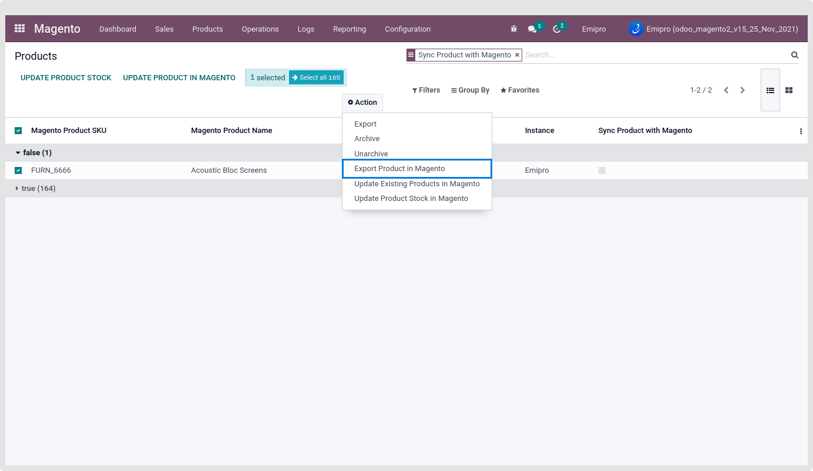
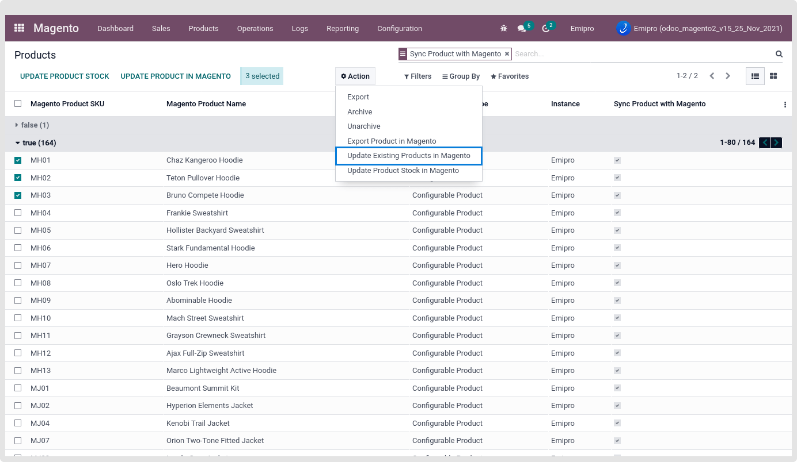
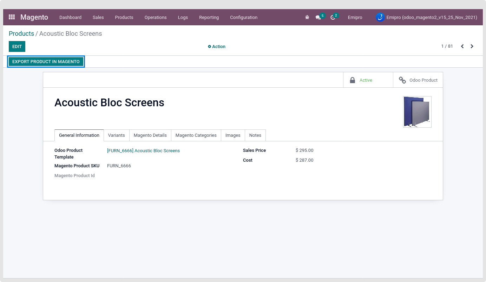
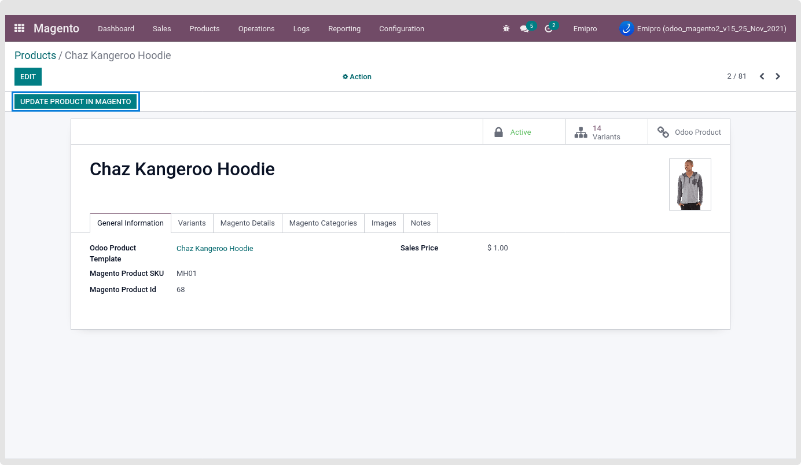
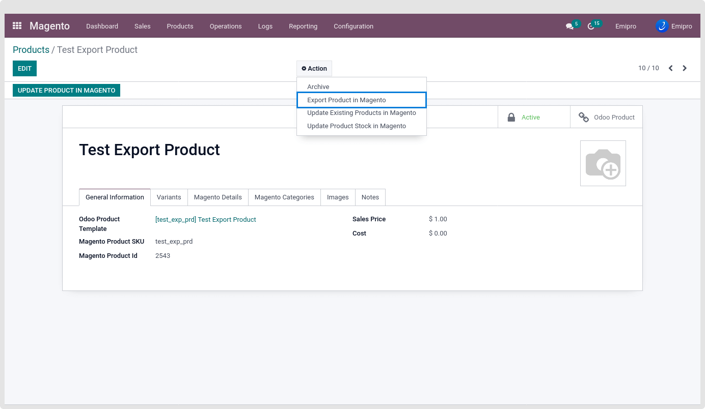
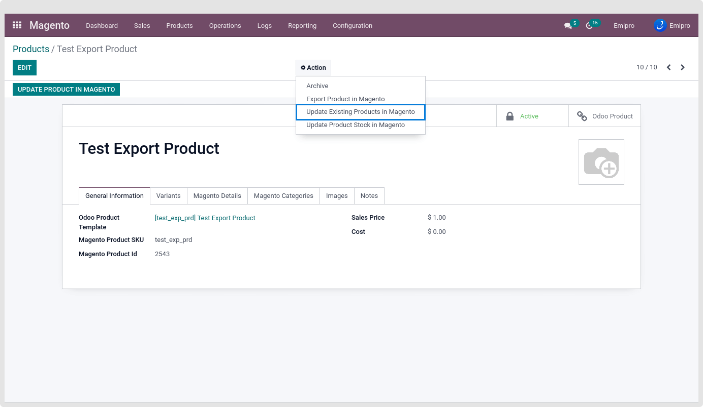

### Export Product

There are some basic required details needed for the Product Export from the odoo to Magento. See below are the basic requirements.

* Import all magento categories
* Import all magento Tax Classes
* Import all the Magento Attribute Groups
* Import all the Attribute sets
* Import all the Attribute options and their values.

Above data is the pre-requirement to perform export product operation successfully. We can import all that data by performing the Import Category, Import Tax Class and Import Attribute from operation wizard.

{:.alert-warning} 
> 
> #### NOTE
> 
> We have already perform the import operations above like import product category,tax class,attributes so kindly refer from import/export operation
> 
> 
> After import Category from Magento to odoo in Case, some of the category Data will be deleted from the Magento and then again perform the import product category so that deleted record will not affect in odoo. This means that deleted records will not be deleted in odoo.
> 
> 
> Our app does not allow updating or Delete operations after the first time imported the Tax Class from magento to odoo.
> 
> 
> 

Now all the pre-required data is imported from Magento to odoo. Now we can create new products and then export Them or update existing products in Magento.

There is one global level configuration for managing the product description and short description from the Magento layer to Magento While creating a new product or updating the Existing product. By default, that configuration is disabled.

 

 

Based on this configuration the product description and short description will be set while creating a new product or updating the product from odoo to Magento.

We can create or update products in Magento only if they exist within the Magento layer.

There are three different ways to create and update the product in Magento.

1. Create and Update from the Tree view Action
2. Create and Update from the Form view Button
3. Create and Update from the Form view Action

 

**1. Create and Update from the Tree view Action**

This feature allows users to create and update multiple products. Go to Magento > Products > Products > Select products > click on action. Perform operations which you want either export new product or update product.

 

It will only allow you to create new products that do not have a Magento product ID and still not sync with Magento.

However, Update Products only allows products that have already been created in Magento and are associated with a Magento product ID into a layer.

 

**2. Create and Update from the Form view Button**

This feature allows users to create and update specific products.

* Create New Product by clicking the Export Product in Magento button.

 

* Update Existing Product by clicking on Update product in Magento button.

 

**3. Create and Update from the Form view Action**

Using this option, users can create and update specific products as well. Open any Products into layer then click on action and perform export/ update products into Magento.

* Create New Product

 

* Update Existing Product

 

Using our connector we are allowed to create and update “Simple Product” and “Configurable Product” only.

* Create New Simple Product
* Update Simple Product
* Create New Configurable Product
* Update Configurable Product

