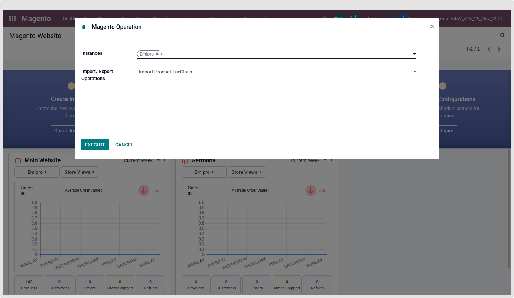
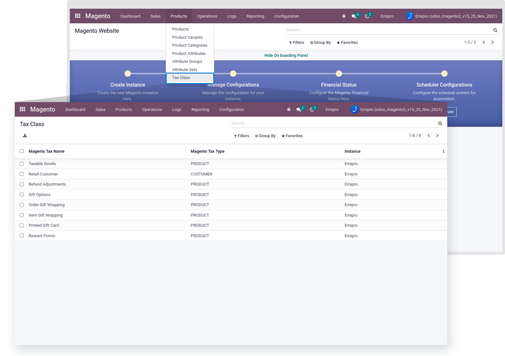

### Import Product TaxClass

By performing this operation all the Magento’s Tax Class is imported from magento to odoo.

 

All Tax Class data will list under the Magento > Catalog > Tax Class.

 

{:.alert-warning} 
> 
> #### NOTE
> 
> Our app does not allow delete operations after the first time importing the Tax Class. 
> 
> 
> 

