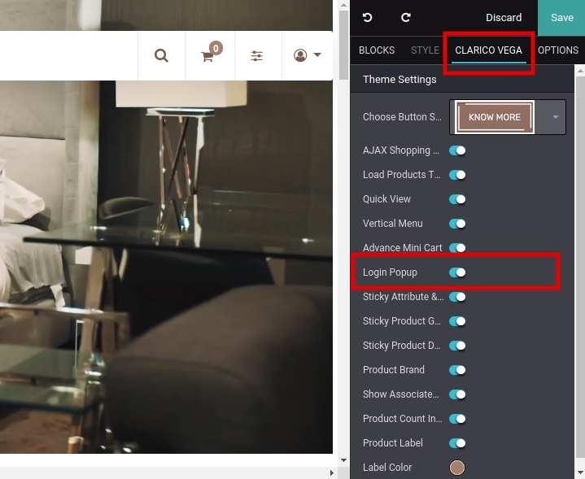
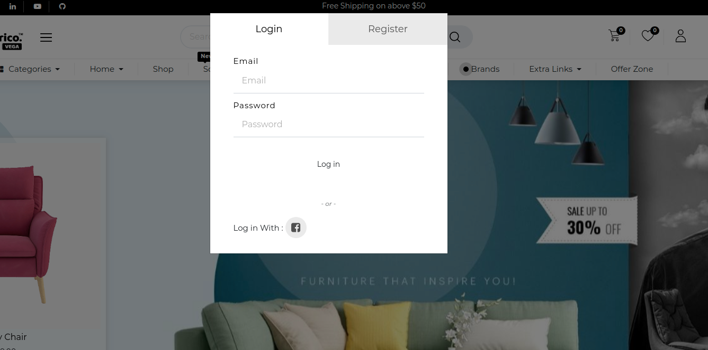

### Log in & Sign up Popup

This feature allows the customer to login and register very quickly. They don't have to browse the Login / Register page. In a single pop-up, customers can enter the username & password, registration link, reset password and authentication provider. So, for particular actions, they don't have to navigate every page.

To enable Log In & Sign Up popup, open Website Editor from the Website & click on **Clarico Vega** option. You can find the Login Popup option as shown as below screenshot. Enable that option & save the changes.

 

 

