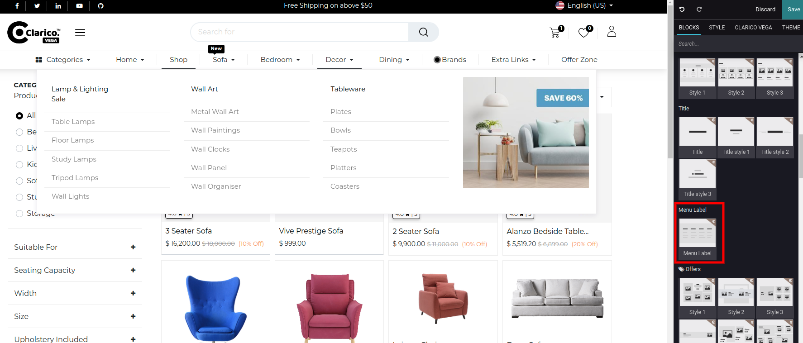
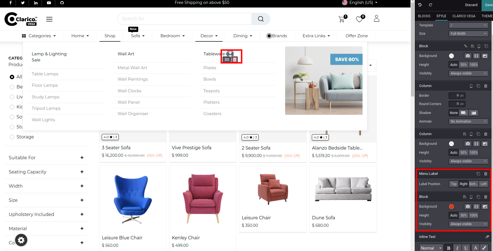
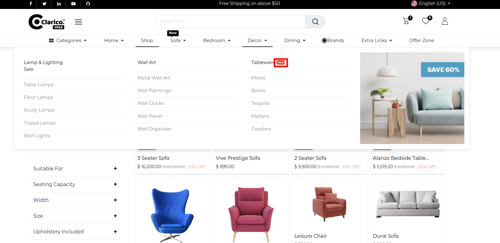

### Menu Label Inside Mega Menu

Using this feature, you can display one label on top of the Mega menu item or the right side of the menu. You can add the display text for the label as well you can configure the color of that menu label.

Steps to configure Menu labels for Category and Sub-Category:

* Step 1: Go to the website and click on the edit button to open Website Editor.
* Step 2: Click on the mega menu in which you want to add the menu label.
* Step 3: Drag and drop the Menu Label Snippet under the Mega Label Section.

* Step 4: You Can easily set different background color and positions for the menu label for that select the Menu label which you need to change.

Front-end View

{:.alert-warning} 
> 
> #### NOTE
> 
> Menu Label will not work with Mega Menu style 2,4 and it will work for 1,3,5,6 and also It will also work default Odoo Mega Menu styles.
> 
> 
> 

