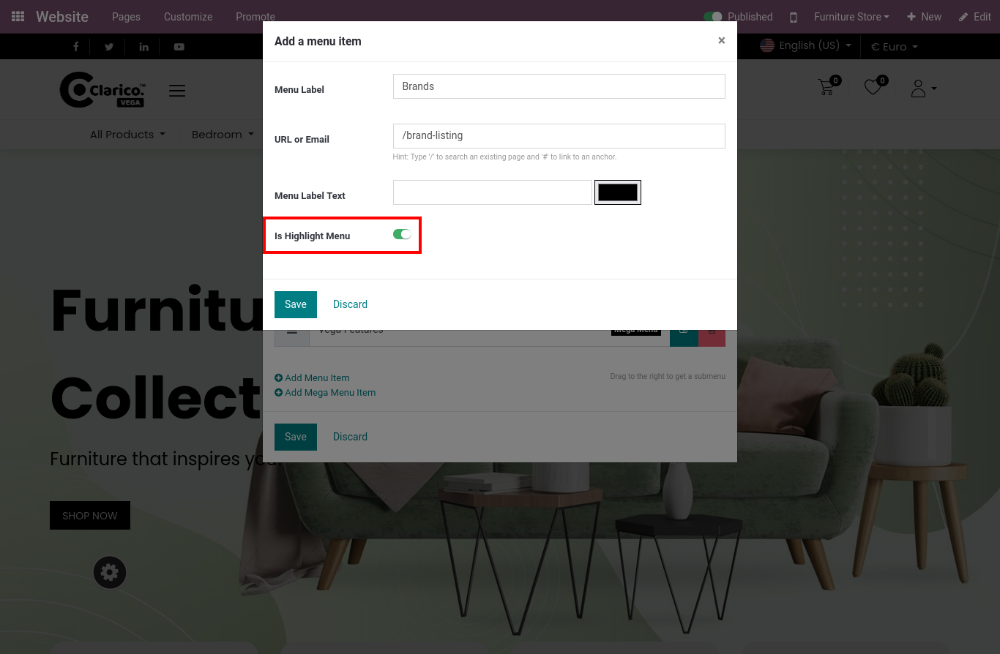
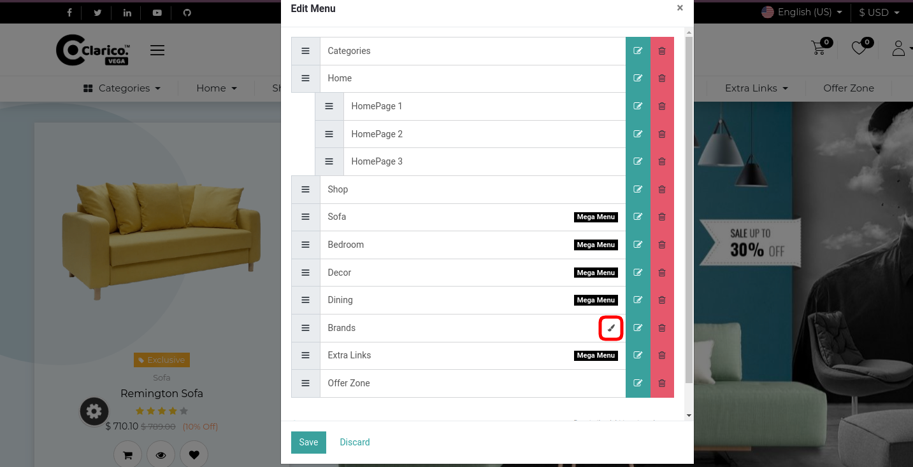

### Highlighted Menu

Sometimes there is a need to highlight a particular menu item. You can highlight a menu by adding a different background color, text color, etc to the particular menu item using custom CSS.

Steps to set the Highlight the menu:

* Step 1: To create a Highlighted Menu, go to a Web Page / Pages / Click on any Menu In which you need to add the Highlighted menu.

* Step 2: It will show one popup to Add Menu Item In that Just click on the Is Highlight Menu.   

 By selecting this option it will set a highlighted menu for that menu item.

If you wish to remove this Highlighted Menu then please uncheck the Is Highlight Menu.

{:.alert-warning} 
> 
> #### NOTE
> 
> You are able to set Multiple Highlighted Menus and We are using the buddle background color as the Primary color. There is no configuration to change that background.
> 
> 
> 

