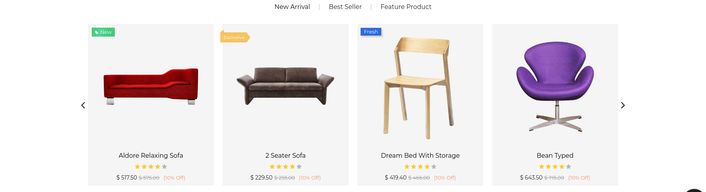
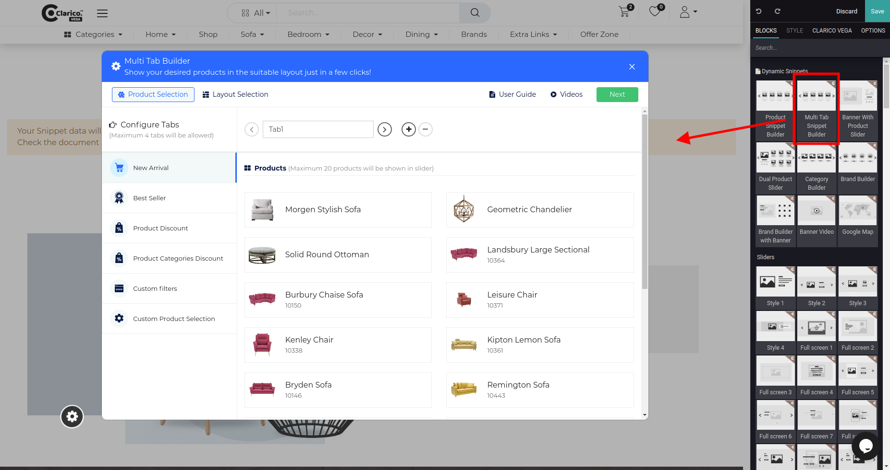
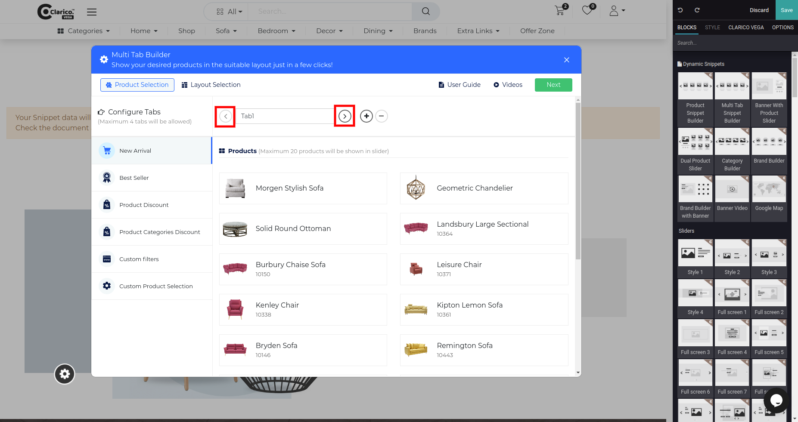
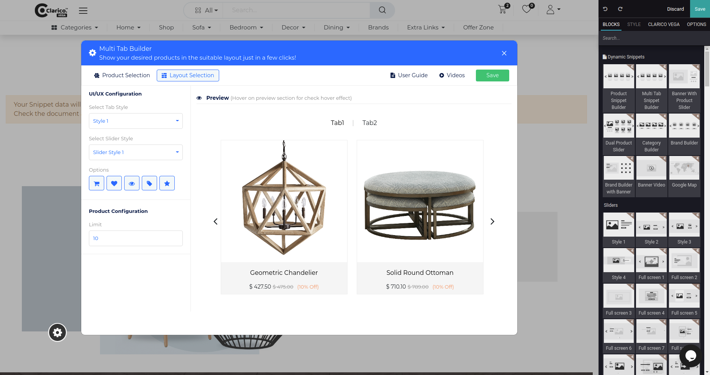
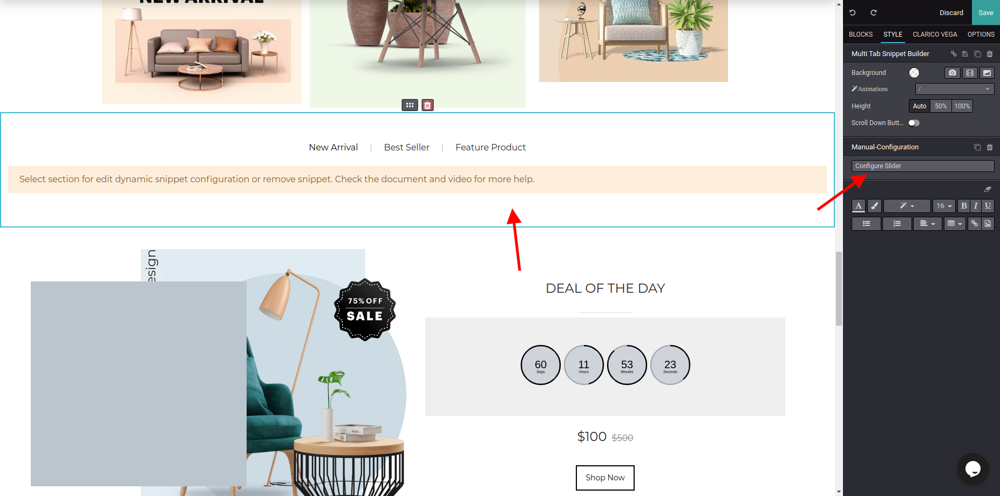

### Multi Tab Snippet Builder

Multi Tab Snippet Builder provides the functionality to showcase the multiple tabs with various products and options like New Arrivals, Best Sellers, Product Discount, Product Categories Discount, Custom Filters, and Custom Product Selection. You can select different options for the different tab.

To configure **Multi Tab Snippet Builder**, Go to the webpage where you want to configure the slider. Click on the edit button from the top right & drop the Multi Tab Snippet Builder from the Dynamic Snippet portion as shown below screenshot.

Configure Product selection for other tabs using tab navigation as shown below

You can add or remove the tab from the quick add and remove button shown below. You can configure a maximum of 4 tabs and a minimum of 2 tabs.

Click on the Next button for Layout Selection and other UI Options like add to care wish list etc.

In the Layout section, you can configure the slider's layout-related configuration. Also, you can configure the tab style, slider style, and display options like Add to Cart, Wishlist, Quick View, Sale Lale & Rating options. In Product configuration, you can set the limit of the product count to display in the slider.  

To update the tab style, slider style, product limit, display options on the configured snippet. Open the edit mode & click on the snippet section as shown below screenshot and click on the configure slider.

