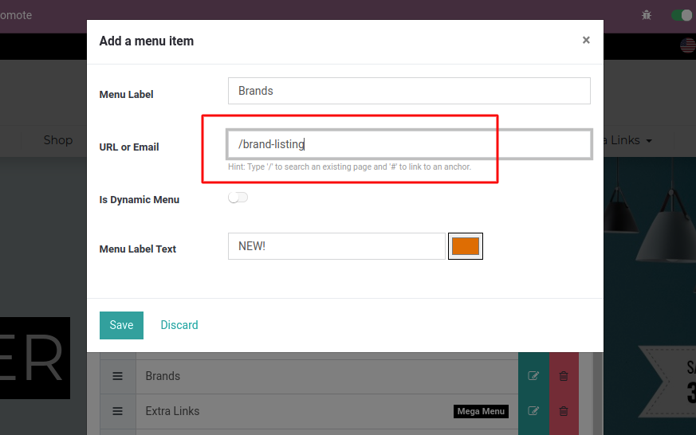
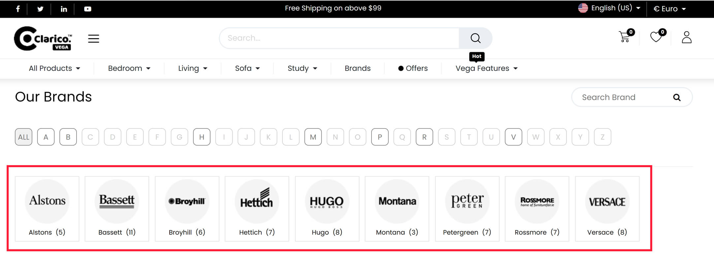
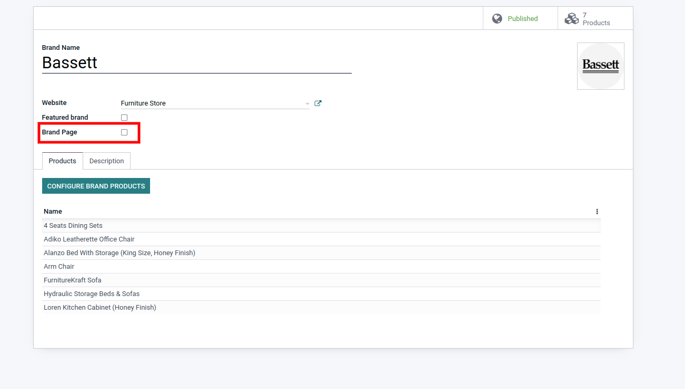

### Product Brands Listing Page

In the Brand listing page, customers can see all the published brand listings along with its name. On the top of the page, customers can see the alphabetical quick navigation. First of all you need to create new menu for the Brand listing page redirection in order to navigate the end user. Create new menu from the Website and assign /brand-listing URL as per the below screenshot in order to navigate the end user into the Brand Listing page.

* When you click on the menu 'Brands', you will be redirected on the Brand Listing page directly as per the below screenshot. Where you can see all the featured brands on the top and then all the brand listing in alphabetic manner.

* Configuration for display brands in Featured Brand portion: Open that brand record in backend & enable the Featured Brand option true as per the below screenshot.

 

