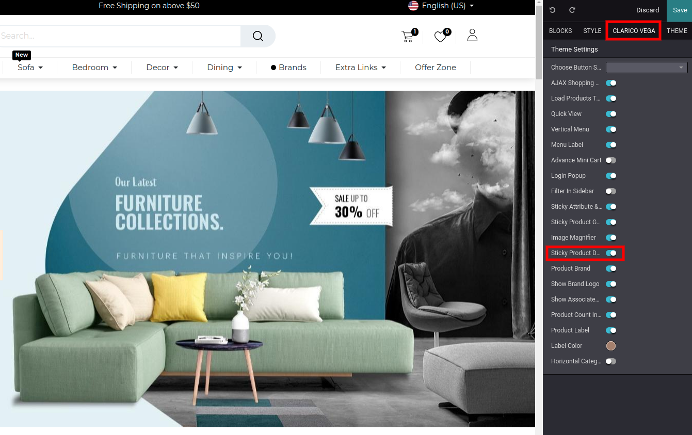
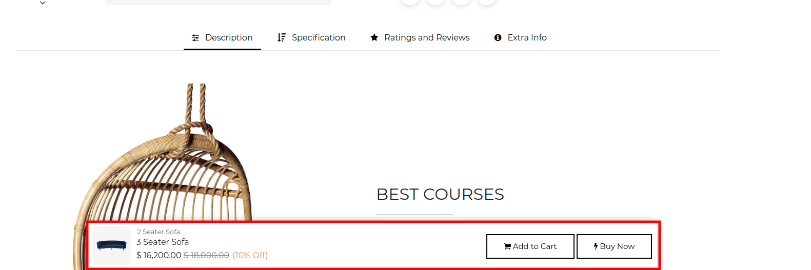

### Sticky Product Details

This feature sticks product details such as product image, price information at the bottom of the page with the **Add to Cart** button and **Buy Now** option. This feature allows customers to increase the efficiency of the cart to the items.

  

To enable Sticky Product Details, open Website Editor from the Website & click on **Clarico Vega** option. You can find the Sticky Product Details option as shown as below screenshot. Enable that option & save the changes.

 

