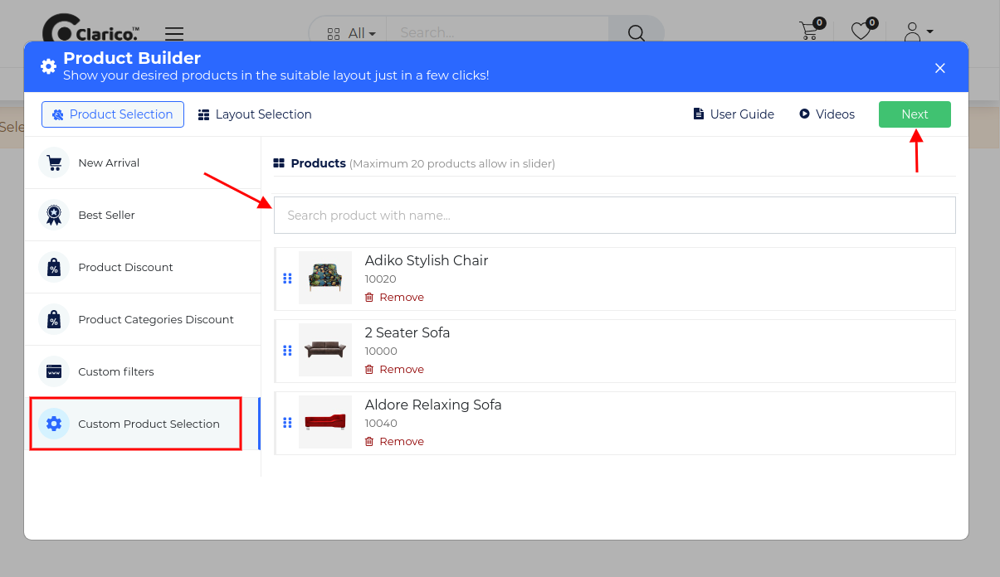

### Custom Product Selection

Product Snippet Builder providing the functionality to showcasing the selected products on the website.

To configure **Product Snippet Builder - Custom Product Selection**, go to the webpage where you want to configure the slider. Click on the ‘Edit’ button from the top right & drop the Product Snippet Builder from the Dynamic Snippet portion and click on the Custom Product Selection option as shown below screenshot.

{:.alert-warning} 
> 
> #### NOTE
> 
> Layout Selection preview is same for all the styles of Product Snippet Builders ie. New Arrivals, Best Sellers, Product Discount, Product Categories Discount, Custom Filters, Custom Product Selection. Where you can configure UI/UX and Product Configuration. You can see the screenshot of Layout Selection in the New Arrival feature description.
> 
> 
> 

