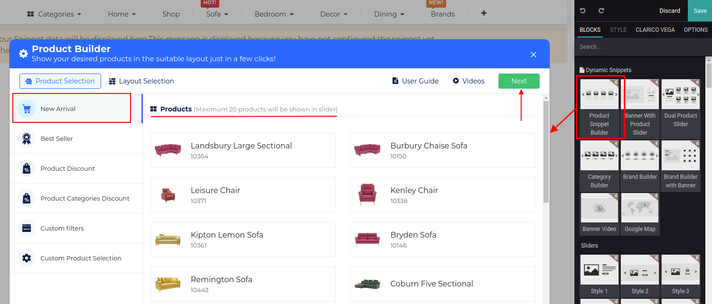
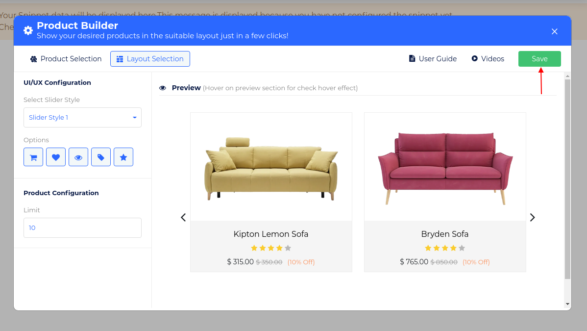
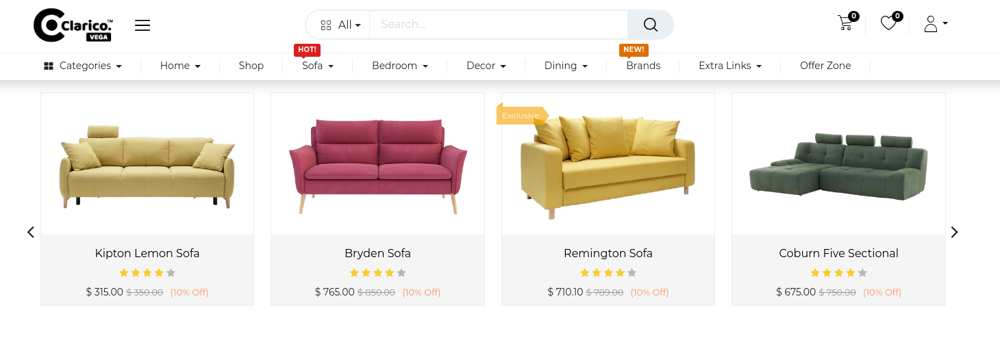
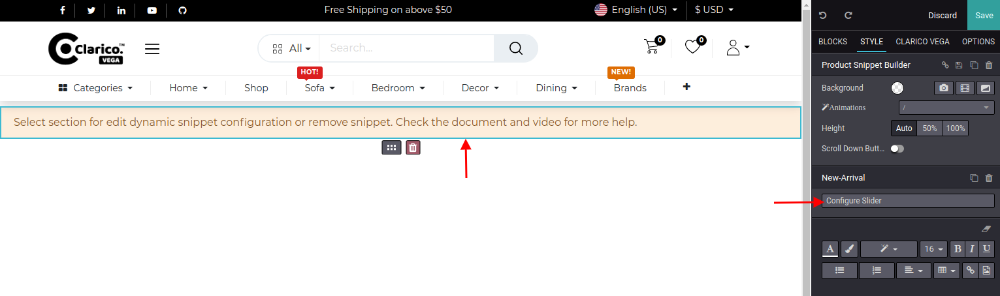

### New Arrival

To configure **Product Snippet Builder - New Arrival**, go to the webpage where you want to configure the slider. Click on the ‘Edit’ button from the top right & drop the Product Snippet Builder from the Dynamic Snippet portion as shown below screenshot.

New Arrival option selected by default when snippet drop. All the New Arrival products will be listed as you can see in the above screenshot. Click on Next button for Layout Selection purpose.

In the Layout section, you can configure the slider's layout-related configuration. In UI/UX configuration, you can configure the slider style, display options like Add to Cart, Wishlist, Quick View, Sale Lale & Rating options. In Product configuration, you can set the limit of the product count to display in the slider. You can visualize the slider's behavior inside the preview section while changing the slider style. Click on 'Save' and save your changes from the web editor.

{:.alert-warning} 
> 
> #### NOTE
> 
> You can update the slider styles, product limits, display options within the configured snippet. Open the Web Editor & click on the snippet portion as shown as below screenshot and click on the specific option of into the Editor.
> 
> 
> 

 

