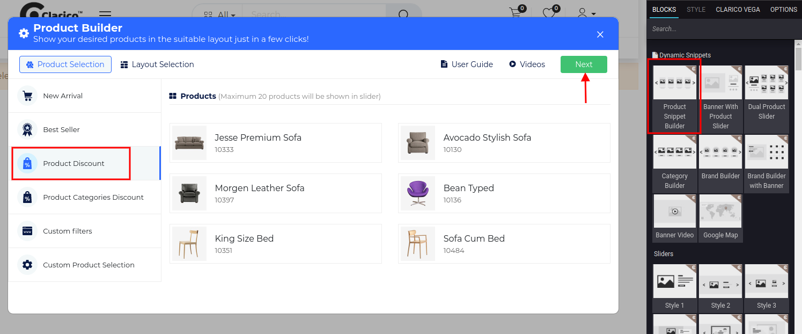

### Product Discount

Product Snippet Builder providing the functionality to display those products which have configured product discount under pricelist of the current website.

To configure **Product Snippet Builder - Product Discount**, go to the webpage where you want to configure the slider. Click on the ‘Edit’ button from the top right & drop the Product Snippet Builder from the Dynamic Snippet portion and click on the Product Discount option as shown below screenshot.

All the discounted products will be listed from the current pricelist when you select the option Product Discount. Click on Next button for Layout Selection purpose.

{:.alert-warning} 
> 
> #### NOTE
> 
> Layout Selection preview is same for all the styles of Product Snippet Builders ie. New Arrivals, Best Sellers, Product Discount, Product Categories Discount, Custom Filters, Custom Product Selection. Where you can configure UI/UX and Product Configuration. You can see the screenshot of Layout Selection in the New Arrival feature description.
> 
> 
> 

