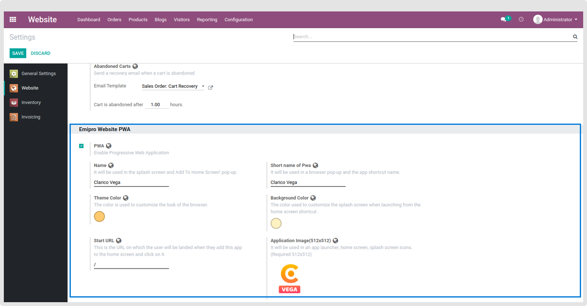
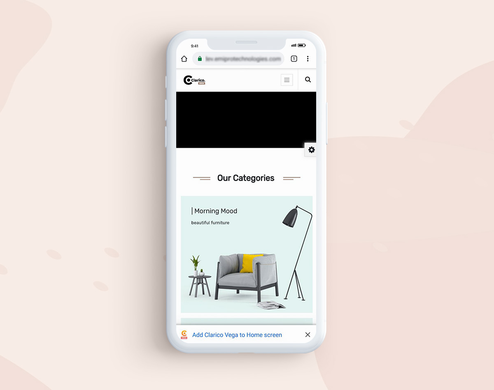
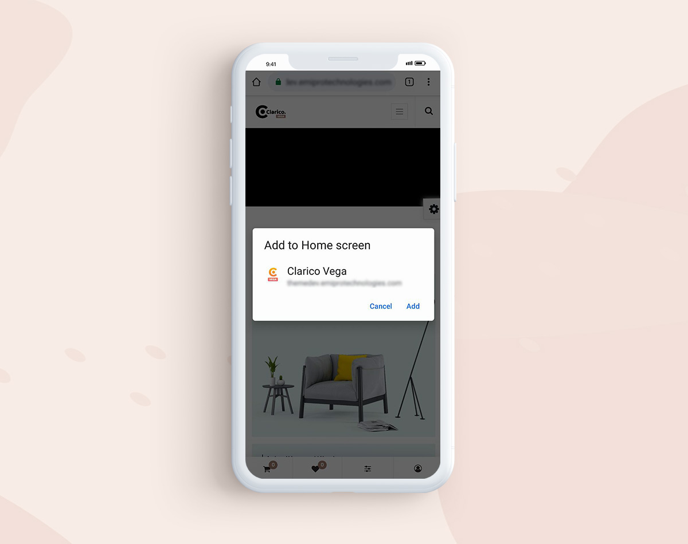
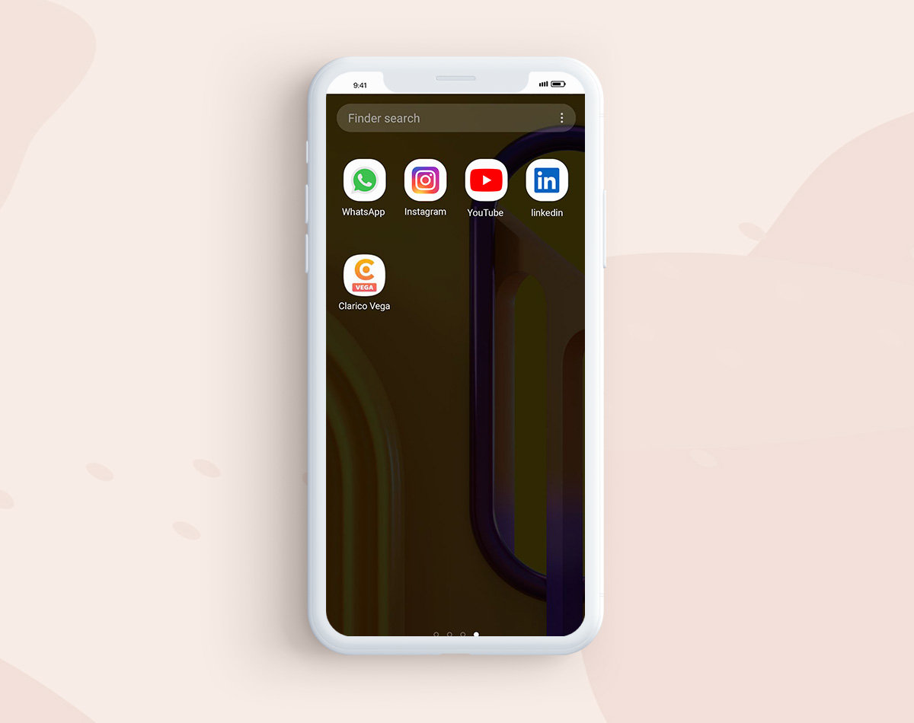
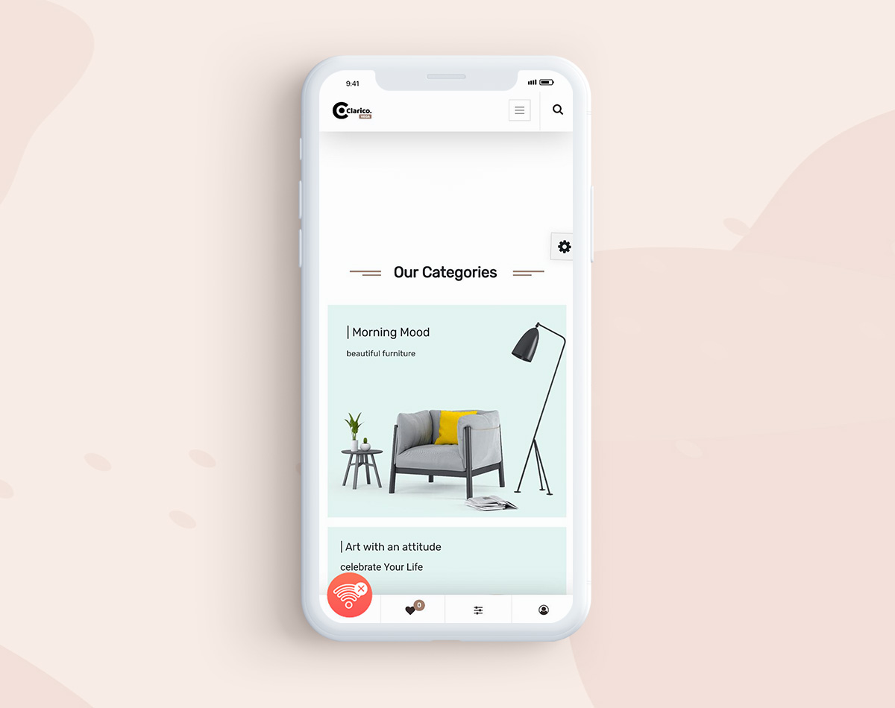
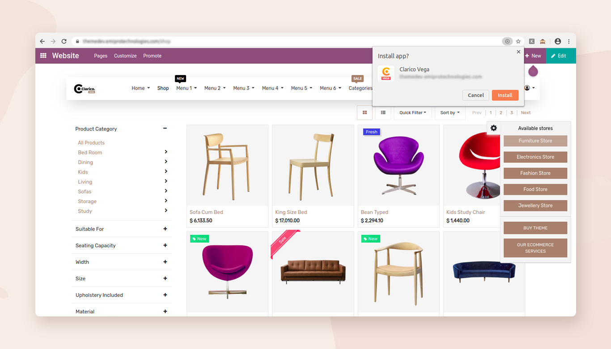
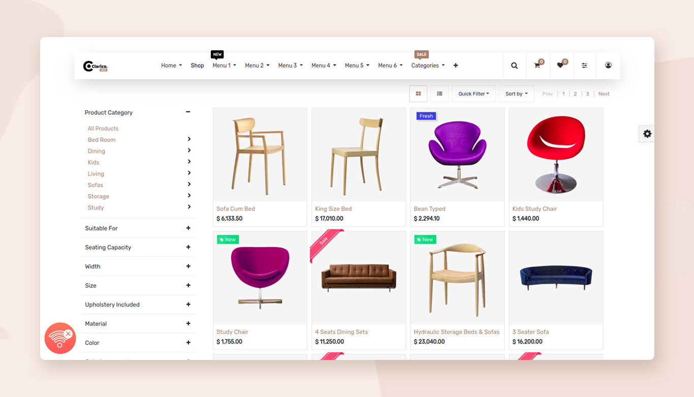

### Progressive Web App (PWA)

Progressive Web Apps (PWA) is an app built from web technologies but with a feel and functionality that rivals an actual native app. It is built and enhanced with modern APIs to deliver native-like capabilities, reliability and installability while reaching anyone, anywhere, on any device with a single codebase.

### **Configurations**

To make your website work like native apps via PWA, we need to configure certain things in the Odoo. Navigate to Website / Configurations / Settings and go to Emipro Website PWA section. You will come across various fields.

* PWA: Enable the checkbox to make your Odoo Website ready to work like a native app.
* Name: Enter the suitable name for your native app that will be visible on the splash screen and Add To Home Screen’ pop-up.
* Theme Color: The colour you select here will be used to customize the look of the browser or application.
* Background Color: The colour used to customize the splash screen when launching from the home screen or application shortcut.
* Start URL: This is the URL on which the user will be landed when they add the app to the home screen and click on it.
* Application Image (Must be 512x512 Width & Height): It will be used in an app launcher, home screen, splash screen icons.

 

## **Add To Home**

## **Add To Home Pop-Up**

## **PWA like Native App**

## **Mobile View Splash Screen**

## **Offline View**

## **Desktop View Install App Pop-Up**

## **Desktop View Offline**

* PWA works only on HTTPS environments. It does not support traditional HTTP.
* PWA is compatible with Chromium-based Web Browsers only. It runs best on Google Chrome (v49 and above), Microsoft Edge, and Opera. Make sure, your web-browser should be latest and keep updating regularly to fully support the PWA that you create.
* Safari and Mozilla Firefox do not support the PWA (at the time of writing this guide).
* If you want to check whether your Web-Browser is compatible with PWA, visit https://whatwebcando.today/ (Go to this section => App Lifecycle => Home Screen Installation if it's Yes then your browser PWA compatible).
* For iOS device PWA compatibility, users need to create separate images for the app Splash Screen. Reference Site - https://appsco.pe/developer/splash-screens. Once you create the splashcreen, you need to just replace those Images with existing one from the theme module at this given path: theme\_clarico\_vega/static/src/img/splashscreens.
* Multi-Language is not supported (at the time of writing this guide).
* If your Internet is off/not working, PWA will not work flawlessly. Only cached data can be accessed at the same time.

