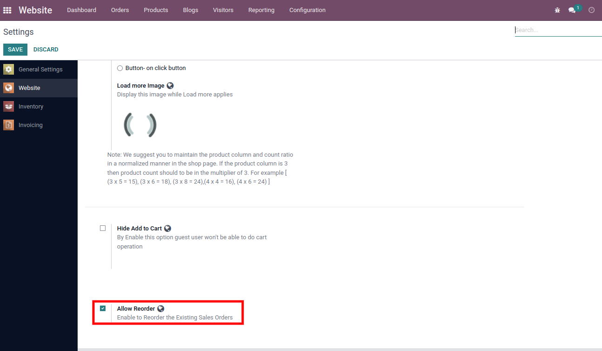
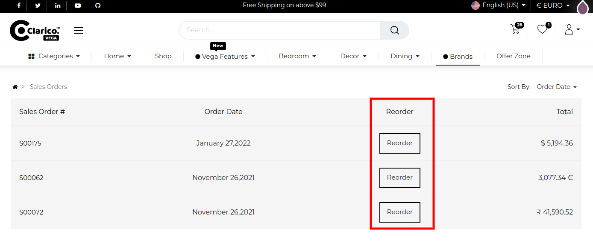
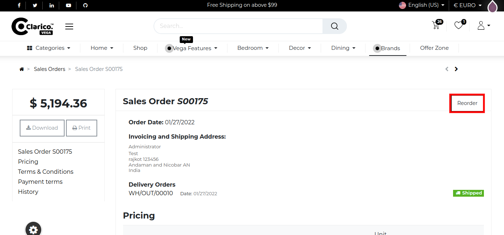
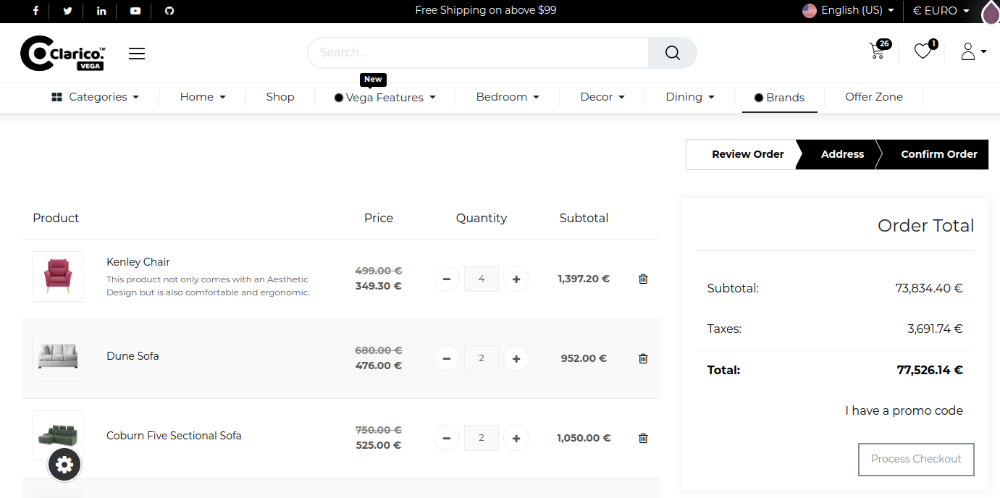

### Reorder

Using this feature, customers can reorder favourite products based on previous purchases.

* To enable/disable Reorder, Go to **website -> Configuration -> Settings -> Emipro Theme Settings Tab**

* When this feature is enabled, it will appear in the Sales Order section under **My Account -> Sales Order**

**Order Listing Page**

**Order Details Page**

* When the reorder button is clicked, a popup will appear if several items are out of stock, otherwise it will add the items to the cart and redirect the user to the checkout page.

