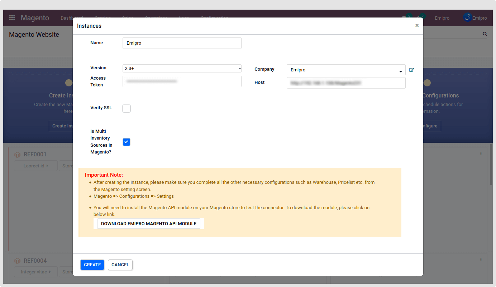

### Magento Extension installation

Integrating your Magento with your Odoo can interconnect disparate parts of your business, improving data visibility and accuracy. To associate both of them, Magento Extension is the key player who can break data out of silos to lead to faster order processing, improved visibility into shipping requirements, and better customer experience. Hence, this is the basic configuration.

Magento2 Odoo connector is going to be installed on the Odoo server. This plugin Emipro 'Apichange' is required to install on the Magento server.

Magento does not provide API for the Delivery Methods, payment method, and website/store by default. Also, in the Magento product API response, we don't get the required product details for odoo, so we have prepared our custom API to get the required information from Magento to Odoo. So that's the reason we need this plugin 'Apichange' to be installed in the Magento server.

 

After filling in all the required details in the instance creating wizard, Please download the Magento 2 Plugin.

